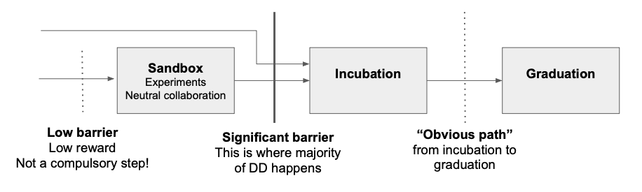

# CNCF Project Lifecycle & Process 
v1.6, previously "project proposal process v1.5"

## Table of Contents
- [Project Stages](#project-stages)
- [Project Lifecycle Process](#project-lifecycle-process)
- [How to Move Levels](#how-to-apply-to-move-levels)
- [Timelines](#timelines)
- [Project Resources and Guide Posts](#project-resources-and-guide-posts)
- [Additional Information](#additional-information)

## Introduction 
This document outlines the CNCF project lifecycle - a multi-stage evaluation which helps ensure cloud native projects meet defined standards of maturity, security, and production readiness for adopters. It includes the criteria for each stage and the process for transitioning between levels. 

 The TOC defines 4 stages of the project lifecycle:

* **[Sandbox](https://sandbox.cncf.io)** - Experimental or innovative projects early in their development.
* **Incubation** - Projects gaining adoption, focusing on improving stability and maturity.
* **Graduated** - Highly mature, robust projects whose adopters have demonstrated their production-readiness by their deployment to production environments.
* **[Archived](archiving.md)** - Inactive or low activity projects that are no longer supported by the TOC or are not recommended for use due to a variety of factors (project specific)

## Project stages

**Sandbox**:
Sandbox projects are the initial stage in the CNCF's project maturity levels. These projects represent innovative and experimental ideas, often involving new technologies or offering unique approaches to existing technologies. At this early stage, failure is a possibility, but the focus is on evaluating the project's potential impact and value to the ecosystem. Sandbox projects are expected to undergo significant changes, including breaking changes to their functionality. They are in a continuous state of evolution, refining their release processes and integrating feedback from both contributors and early adopters who are willing to experiment with less mature technology. They are experimental; they might still be used in production by a few organizations on a case to case basis.

**Incubation**:
Incubating projects in the CNCF represent the middle stage of project maturity. These projects have progressed beyond the experimental phase of the Sandbox and are starting to demonstrate stability. Incubating projects exhibit a slower rate of change, with fewer breaking changes and more stable, versioned APIs. This signifies that the project's core functionality is solid, making it more reliable for production use. Importantly, this stage marks the point where the CNCF's Technical Oversight Committee (TOC) begins to actively evaluate the project's adoption. The TOC assesses the project's usefulness to interested parties, gauging its potential for wider adoption and integration within the cloud native ecosystem.

**Graduation**:
CNCF Graduated projects represent the pinnacle of project maturity within the Cloud Native Computing Foundation's ecosystem. These projects have successfully navigated the previous stage(s), demonstrating a high level of stability, functionality, and widespread adoption within their specific market area. Graduated projects are characterized by their adherence to mature and evolved practices, ensuring consistent and reliable performance. They offer a high degree of confidence to adopters and contributors alike, demonstrating stability, robust performance, comprehensive security measures, and active engagement with the community. Reaching the Graduated level signifies that the project has proven its value and is considered a reliable and trusted solution within the cloud native landscape.

**Archived**:
Archived projects are inactive or no longer recommended for use. This stage ensures the CNCF community focuses on active, impactful projects.
Refer to the archive process (here)[https://github.com/cncf/toc/blob/main/process/archiving.md]

---

## Project Lifecycle Process

Projects may enter the CNCF either by applying as a sandbox project or applying directly for incubation. As a project navigates their maturity journey, their completion of a given level's criteria is evaluated by the TOC in a process called Due Diligence to ensure the project's implementation of the criteria meets the desired outcome, intent, and expectations set forth by the TOC.

Due Diligence Enhancements:
To streamline the evaluation process, the TOC has:
- Reduced duplication of work.
- Improved transparency for projects and their adopters.
- Simplified handoffs during evaluations.

For project resources on the lifecycle process, please refer to the section on 
[Project Resources and Guide Posts](#project-resources-and-guide-posts).

##  Naming conventions for projects

All CNCF projects are subject to the [Trademark Usage Policies](https://www.linuxfoundation.org/legal/trademark-usage) set by the Linux Foundation. Specifically, new or incoming projects should avoid using existing trademarks in their proposed project names. In addition, if they are intending to use a popular prefix/suffix of an existing project (like "kube" or "k8s"), then they should consult the leadership group(TAG) of the respective project to seek their approval and document the consensus reached. Existing projects are encouraged to document their naming guidelines to make this process smooth as well to avoid lengthy deliberation processes for new project names.

---

## How to apply to move levels

### Applying to Sandbox

**Note: The TOC has changed the sandbox application process to a more transparent and streamlined workflow within the :package: [Sandbox Applications repository](https://github.com/cncf/sandbox) :package:.**

Projects apply for sandbox through the Sandbox Repo's *[Issue Form](https://github.com/cncf/sandbox/issues/new?assignees=&labels=New&projects=&template=application.yml&title=%5BSandbox%5D+%3CProject+Name%3E)*. More information on this process is found on the main [Sandbox repo page](https://github.com/cncf/sandbox).
All exceptions and "declined" or "postponed" outcomes are handled by the TOC. Projects may be encouraged to re-apply after addressing areas called out in the application comments on the corresponding issue. Please refer to the instructions in the [Sandbox repo README](https://github.com/cncf/sandbox) for more details on re-application.

### Applying to become an Incubating or Graduating project

While the details of the process are described in detail further for Incubating and Graduating proposals, the high level steps that occur when a project moves levels are as follows:

#### Applications to move levels are done by submitting an incubation or graduation [application issue](https://github.com/cncf/toc/issues/new/choose) on the TOC repo
*Who: Project*

* Projects seeking to move to incubation should submit the Incubation Application issue and detail how they meet the incubation level criteria with links to evidence of implementation, existing incubating projects seeking to move to graduation should submit the Graduation Application issue and detail how they meet the graduation level criteria with links to evidence of implementation.
* **Project must complete the [Adopter Interview Form with 5-7 adopters willing to be interviewed](https://docs.google.com/forms/d/1n1oLC6IKj5-7S_xeEjIdEjbtS9SWniuAo7IIOyLFuK8/)**.
* As prior applications are closed, the TOC selects the next project from the "ready for assignment" column of the [TOC project board](https://github.com/orgs/cncf/projects/27/views/9)'s **Applications to Move levels** tab. 

#### The TOC triages project applications for completeness
*Who: TOC*

* Project applications that are found to be incomplete will be commented with the outstanding areas to be completed, closed, and moved to Not Ready- Will return in the [TOC project board](https://github.com/orgs/cncf/projects/27/views/9)'s **Applications to Move levels** tab. 
* When a project has completed all outstanding areas, the project can re-apply, link to the previous application, and reuse any previous content as appropriate.

#### A TOC sponsor(s) is assigned and the project is moved to 'TOC DD Eval' on the project board
*Who: TOC*

#### Application Kick off Meeting is scheduled and held
*Who: TOC Sponsor(s) and Project*

* The TOC will schedule time with the project to set expectations and lay out the process. The TOC will use the meeting notes document to capture blockers, recommendations, and other findings as they review the issue and the project's repositories, channels, release process, metrics, governance, and other sources of information that support the project's completion of the criteria. The TOC member will refer back to these notes to support their formulation of the Due Diligence PR. The project is asked to identify 5-7 adopters for interviews. 
* If the TOC sponsor(s) finds that the project is not yet ready to move levels, they will re-engage with the project to discuss next steps, detail specific blockers that prevent the project from moving, and any actions that need to be completed but are non-blocking. The Application issue is updated with this summary once the project is discussed.

#### Due Diligence creation or refresh
*Who: TOC Sponsor(s)*

* Once all recommendations, blockers, and other findings are resolved, the TOC member will begin crafting the Due Diligence PR that provides their evaluation of the project's completion of the criteria, any compensating mechanisms in place, or other notables that may influence the TOC's decision to move the project to the next level.

#### Adopter Interviews are conducted
*Who: TOC Sponsor(s) and Adopters*

* Depending on the freshness of prior interviews the TOC may choose to not conduct further interviews or conduct others to ensure coverage by a variety of adopters to explore all facets of the project. The project is updated on the project board.
* The TOC will reach out to adopters to inform them of how interviews are conducted and to address any anonymity or other concerns they may have. The TOC will ensure adopters have final approval of any published summaries of the interviews that are included in the due diligence PR. 
* If multiple TOC members are sponsoring, they will conduct their own individual reviews and then coordinate with each other on overall observations, findings, and next steps.

#### TOC internal comment period
*Who: TOC Sponsor(s) and TOC*

* Assuming all outstanding issues are resolved, the TOC opens an internal comment period, about 1 week, for other TOC members to perform an independent review and verify all areas of the project have been evaluated.
* The TOC sponsor may choose to share a WIP PR with the TOC for review and comment internally. If no further issues are identified, the TOC sponsor(s) will finalize and submit the PR to open the public comment period. A message is announced on the toc mailing list. 

#### The project is updated on the project board to 'Public Comment' and **the public comment period is open for two weeks**.
*Who: TOC Sponsor(s)*

#### Voting opens
*Who: Initiate - CNCF Support Staff for the TOC, Voting - TOC and community members*

* Provided no additional items are identified during the public comment period, the TOC opens voting on the PR using gitvote shortly thereafter (usually about 2 days subject to availability). The project is updated on the project board to 'In Voting'.
* TOC members and the community may cast votes and show support by using emoji voting on the gitvote initiating comment.

#### Voting is completed
*Who: CNCF Support Staff for the TOC*

* If the vote passes (2/3 supermajority vote of the TOC), the results are emailed and the project is placed in the 'Done' state on the project board.
* An announcement is made conveying the project name and its new level status.

#### Criteria

Projects can find the criteria for Incubation by reviewing the [Incubation application template](../.github/ISSUE_TEMPLATE/template-incubation-application.md).

Projects can find the criteria for Graduation by reviewing the [Graduation application template](../.github/ISSUE_TEMPLATE/template-graduation-application.md).

---

### Timelines

#### Expectations

The TOC makes no guarantees on if or when a project will join the CNCF or move levels. Projects apply for moving levels when they feel they are ready. However, what is ready for one project is not the same for another nor is each project’s adoption and maturity measurable against one another. For some projects it may be a long journey with the TOC to bring them to maturity for the kind of project they are and for others it may be shorter - it all depends on the individual project, their readiness, and the availability of the individuals responsible for various tasks in moving levels.

When projects apply for moving levels, they do not move levels on a first-in first-out (FIFO) basis. Some projects join the Foundation when they are already far along in their journey and others join very early. They will approach maturity guide posts differently - at different times and in ways similar or different from others. We do our best to support projects moving levels, in some cases engaging with them frequently to ensure they are making progress on our initial findings but leaving the application open.  In other cases, we review the project and finding nothing disparaging, only needing to refresh the content of the previous due diligence, evaluate against the next level of criteria, and move it forward.

For sandbox proposals, applications are reviewed in the order the TOC chooses, most commonly returning applications first and then from oldest application to newest every two months. The TOC may not have time to get through every application each meeting as different project applications carry varying considerations and discussion topics to ensure enough information is discovered and explored to make an informed decision. The up to date list can be found [here](https://sandbox.cncf.io/) and will be carried over from meeting to meeting if not every project is reviewed.

For moving levels to incubation or graduation, projects should plan on _at least 3 months_ once a TOC member steps forward to sponsor the project's application (assigns themselves to the issue). 

#### KubeCon+CloudNativeCon Freeze

Due to the increased community demands around KubeCon + CloudNativeCon (KCCN), the scheduling and production of content, and reduced availability of individuals involved in moving levels, the TOC leverages a freeze for projects in process for moving levels. Even if a project is approved to move levels 3 weeks before this event, projects should _not_ expect to receive benefits beyond those afforded for the level they were previously at. For example, if a sandbox project is approved to move to incubation 3 weeks prior to the event, the project and the event staff will not have enough time to record, edit, and produce an incubating project update to have it included within the keynote stage reel.

For KubeCon + CloudNativeCon's (KCCN) Europe and North America — the following freeze is applied:

__Within 4 weeks of the event__

* TOC members will not take on new sponsorship of applications for moving levels
* Many activities occur before, during, and after KCCN. Postponing new sponsorship until after KCCN reduces the likelihood that kicking off the process is overcome by such activities.
* Public Comment will not open
 * We want to ensure community members, adopters, and other stakeholders have time to participate in the public comment of projects, the 2 weeks leading up to the event are typically very busy for many individuals involved in the moving levels process.
* Voting for projects will not open
 * Voting is an opportunity for community members to show support for projects, it is also the time when the TOC determines if the due diligence and state of the project support its promotion to the next level. As such it is essential for TOC members to have time to not only cast votes, but to consider any comments raised during the public comment period. The TOC is just as busy as any other attendee or speaker for KCCN, it is easy to miss the timeframes for voting and we want to ensure projects receive the attention in a vote they deserve.
* Open voting is paused
 * While community members may continue to show support for projects, the TOC will officially pause our voting.
* No project announcements
 * Even if a project has passed a vote, if they have not announced and officially moved levels, they will not be included as an incubating or graduated project.

__2nd week following the event__

* Voting for projects who completed public comment may open and commence.
* The week immediately following KCCN is commonly reserved as a recovery and digest period for attendees, event staff, community members, and TOC.

The above freeze only applies to KCCN NA and EU. Other events will be subject to the TOC members' availability who are expected to regularly check in with the projects. TOC members may choose to continue working with projects on due diligence within the weeks before and after KCCN subject to their and others' availability. Projects should take all of this into account when planning completion of their due diligence. We ask projects to be understanding and considerate of our availability constraints around KCCN and remind everyone that the TOC is not a full-time body, we have primary work commitments in addition to our involvement on the TOC and any projects, TAGs, or community groups we are involved in.

As the CNCF chooses to create new standalone occurrences of KCCN, this freeze should be reviewed to ensure ample time is available to conduct activities to support project moving levels. It may include restricting to just two freezes a year, or a complete re-evaluation of the freeze in light of whatever changes have transpired.

---

#### Additional information

Q: Why doesn't the TOC get through the sandbox list every meeting?
A: There are currently many projects that want to be a part of the CNCF and it is the TOC's job to carefully consider if they are the right fit for the foundation. This deliberation takes time and there are only so many applications that the TOC can get through each meeting. If anything, a delay from one meeting to the next is a benefit for the project because it allows more time to build community support.

Q: Exactly how long will it take my project to move levels once my application is in?
A: Just like in open source, it will get done when the work is done. This can range from 5 months to 15 months please coordinate with your TOC sponsor to keep everything on track.

Q: Can my project still apply to move levels within 4 weeks of KubeCon?
A: Yes, though getting a TOC sponsor, conducting any due diligence, and any other steps of the process will be delayed until after KubeCon.

Q: Why can't public comment periods or votes launch within 4 weeks of a KubeCon?
A: Undergoing due diligence is a non-insignificant amount of work. Conducting adopter interviews takes time and scheduling becomes increasingly difficult the closer to each KCCN we get. Being able to successfully complete due diligence to launch the public part of the process becomes very difficult as many community members have additional responsibilities related to the conference. By removing KCCN as a goal post for brand new requests to move levels, we hope to not burn out adopters, TOC, maintainers, and other community members.

Q: I meet the criteria, why am I not graduating?
A: There could be a number of reasons why a project is not yet ready to graduate but appears to meet the criteria. The TOC has increased the clarity and desired outcomes the criteria should achieve for projects but require evaluation on a case-by-case basis for each project to understand the implications of their implementation. The TOC has final discretion but endeavours to be transparent and enable projects to successfully and sustainably achieve Graduation status while balancing the needs and expectations of adopters and CNCF members.

Q: How can I ensure my project is on the right path to the next level?
A: Projects are strongly encouraged to meet with their TAG to receive feedback on changes, improvements, and recommendations to assist the project to the next maturity level. Some of these may be domain specific recommendations to ensure a more robust project, or they may be more high level items and encompass engineering principles that need to be codified within the project. TOC members sponsoring a project will reach out to the project's TAG to understand more about the project and ensure they incorporate the TAG's recommendations, notes, and observations within the Due Diligence PR.

---
### Project resources and guide posts

The TOC, with support from the [Technical Advisory Groups](/tags/README.md), have a wide variety of resources available to assist projects.  Current and aspiring maintainers of cloud native projects can find a lot of information and templates on [contribute.cncf.io/maintainers](https://contribute.cncf.io/maintainers/). The TOC also maintains [project Guide Posts](../docs/project_guideposts.md) - a collection of guiding points that have assisted cloud native projects as they grow and mature in the ecosystem. These are not requirements for moving levels, those may be found in the respective application issue templates ([Incubation](../.github/ISSUE_TEMPLATE/template-incubation-application.md), [Graduation](../.github/ISSUE_TEMPLATE/template-graduation-application.md)). The [Guide Posts](../docs/project_guideposts.md) are resources for projects to leverage that are beneficial in meeting or exceeding the criteria defined.

Additionally, projects interested in preparing to apply to move levels are encouraged to pursue the following activities as the resulting artifacts can and often are leveraged in the TOC's completion of the Due Diligence in lieu of certain sections of the DD.

* Pursue a [Governance Review with TAG Contributor Strategy](https://github.com/cncf/tag-contributor-strategy/issues/new?template=governance-review-request.yaml) - A governance review is an in depth look at how your project is governed, its documentation, its practices, and general project operations. For more information please [checkout the maintainer page on governance](https://contribute.cncf.io/maintainers/governance/overview/) or join the [Governance Review Group](https://github.com/cncf/tag-contributor-strategy/tree/main/governance).
* Complete a [General Technical Review (GTR)](../tags/resources/toc-supporting-guides/general-technical-questions.md) or [Domain Technical Review (DTR)](../tags/resources/toc-supporting-guides/tag-domain-technical-review-template.md) - these reviews provide a structured framework to explore the technical lifecycle aspects of a project experienced or sought by adopters as well as dive deep on the design and architecture of the project within its technical domain of focus. The results of these can support projects in identifying next steps to increase usability, resilience, scale, performance, and ease-of-use.
* Collaborate with [TAG Security on a joint-review](https://github.com/cncf/tag-security/blob/main/community/assessments/guide/README.md#joint-assessment) - highly recommended for currently incubating projects, the joint review is a comprehensive assessment of a project's security, it helps project's prepare for a successful security audit.
