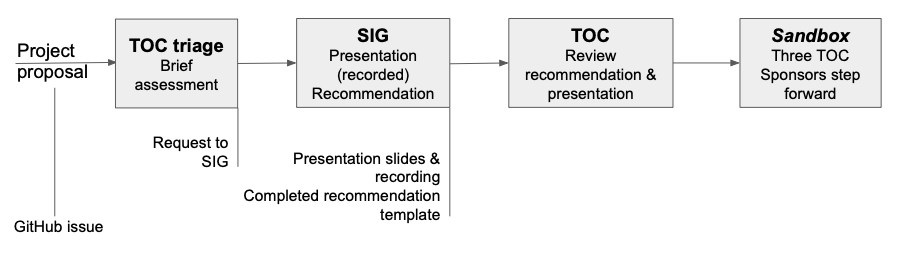
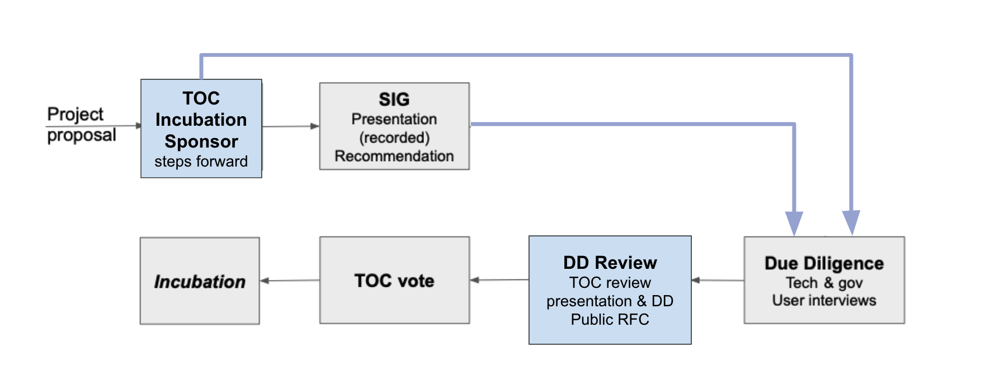

== CNCF Project Proposal Process v1.3

=== Introduction 

This governance policy sets forth the proposal process for projects to be accepted into the Cloud Native Computing Foundation (“CNCF”). The process is the same for both existing projects which seek to move into the CNCF, and new projects to be formed within the CNCF.

=== Project stages

image::project-stages.png[Project stages]

=== Sandbox process

Note: We have changed the sandbox proposal process to a https://docs.google.com/document/d/1IlhqnmhSzs3aTPMkp_75JPYz6LD21aK1sNPrBNruDt0/edit?usp=sharing[new lighter-weight process for Sandbox proposals].

All exceptions (and "no" outcomes) are handled by the TOC. Possible "no" outcomes include "not at this time", and the project may be encouraged to re-apply after addressing issues. Timeframes are approximate, to set expectations.

. *Project Proposal*
   * Project proposed through a https://docs.google.com/forms/d/1bJhG1MuM981uQXcnBMv4Mj9yfV5_q5Kwk3qhBCLa_5A/edit[form]
. *TOC Review*
   * TOC reviews proposal in spreadsheet and presentation, project passes for inclusion with a simple majority vote. 
   * TOC may engage with project to ask further questions
   * Projects may re-apply after six months
. *Governance / legal issues*
   * CNCF staff handle governance / legal issues
   * This can happen after TOC Sandbox Sponsors step forward

See the https://github.com/cncf/toc/blob/main/process/sandbox.md[Sandbox guidelines] for the definition of and motivation behind the CNCF Sandbox.

=== Incubation process

Note: We have https://docs.google.com/presentation/d/1J9nti4JdiwLHxY15KtkmqyfP4OgNfrLAd3vxPvFTzsc/edit?usp=sharing[streamlined the Incubation process].

All exceptions (and "no" outcomes) are handled by the TOC.

. *Project Proposal* 
   * Incubation proposed through a https://github.com/cncf/toc/pulls[GitHub pull request]
   * The proposal moves to Due Diligence when a TOC member steps forward as an Incubation Sponsor.
   * The status of outstanding Incubation proposals is reported on a monthly basis in the TOC public meeting. This highlights projects looking for sponsorship, and provides a check-in on DD progress for sponsored projects. 
   * A potential sponsor can indicate that they are interested but don't have capacity to work on DD at this time, to set a project's expectations.
   * The TOC may agree that the project does not (yet) meet the https://github.com/cncf/toc/blob/main/process/graduation_criteria.adoc#incubation-stage[Incubation requirements] and give feedback on why this is the case. If the project is not already in the CNCF, the TOC may suggest that project apply for Sandbox instead.
   * If a TOC Incubation Sponsor has not stepped forward within two months after the proposal PR is submitted, projects may request that their project proposal is discussed at a forthcoming TOC meeting by adding it to the https://docs.google.com/document/d/1jpoKT12jf2jTf-2EJSAl4iTdA7Aoj_uiI19qIaECNFc/edit[Working Doc]. The outcome of this is discussion is either that a sponsor steps forward, or that the TOC votes to admit the project to Sandbox, or the proposal is rejected (projects may reapply after six months). If, even after all those steps, a sponsor does not step forward, the proposal is rejected. 
   * DD will usually involve a presentation to a TAG, but an interested TAG is welcome to schedule a project presentation at any time. TAGs can discuss their recommendations or concerns about a project with their TOC liaison(s) if there isn't already a TOC Incubation Sponsor in place. 
   * Although it is not necessary, projects are allowed to informally reach out to TOC members for advice, including asking about potential sponsorship. TOC members should keep each other informed about these approaches so that we can avoid falling prey to "lobbying". There is a fine line between a project asking for help to make a successful application, and a project shopping around looking to pressurize a TOC member into sponsorship. 
. *TOC Incubation Sponsor* 
   * TOC Incubation Sponsor is responsible for driving the process, and co-ordinating with TAGs for review and input as they see fit. 
   * TOC Incubation Sponsor is a point of contact for the project throughout the process.
   * TOC members may not sponsor a project for which they have a clear conflict of interest (for example, originating primarily from their organization). This doesn't mean that they can't have any involvement at all - for example, contributing pull requests, or being an end user of that project, can signal a healthy interest in and knowledge of a worthwhile project. 
. *Due Diligence* _2-3 months_
   * TOC Incubation Sponsor drives due diligence (see the https://github.com/cncf/toc/blob/main/process/dd-review-template.md[template] and https://github.com/cncf/toc/blob/main/process/due-diligence-guidelines.md[guidelines]).
   * TOC Incubation Sponsor can delegate DD work to CNCF TAGs and/or other TOC members.
   * Typically DD includes a presentation to a CNCF TAG, as identified by the TOC Sponsor. This step may be omitted if the TOC Sponsor feels there are readily-available and suitable presentations on video - for example, because the TAG has already recently held a presentation. (We do not want unnecessary levels of process or bureaucracy to delay a widely-known and adopted project from joining the CNCF). TOC Sponsor has discretion to arrange alternatives (for example, arranging a Q&A session at a TOC meeting) to ensure there is ample opportunity to ask questions.
   * TOC Incubation Sponsor can ask project maintainers to complete the DD template. (In practice project maintainers sometimes choose to make a start on this in advance of the official DD process, or even in advance of the initial proposal as it may help them ensure they meet all the requirements.) The TOC Incubation Sponsor should carefully review and ask questions about the DD as prepared by the project maintainers, and may also call on TAGs to help with this. 
   * CNCF staff do governance and legal DD.
   * During DD some conversations may be held in private (e.g. user interviews where the user wishes to remain anonymous) and are documented using discretion.
   * TOC Incubation Sponsor confirms that project meets the https://github.com/cncf/toc/blob/main/process/graduation_criteria.adoc#incubation-stage[Incubation requirements].
   * TOC Incubation Sponsor determines when DD is “done”. DD documentation should then be on GitHub, open to public comment on record.
. *Due Diligence review* _2-6 weeks_
   * TOC Incubation Sponsor announces on the TOC mailing list when the DD documents are available for public review and comment, which can take place on GitHub, the TOC mailing list, or at TOC public meetings. 
   * TOC Incubation sponsor decides when to call TOC vote, allowing at least two weeks for public comment before calling vote
. *TOC vote* _up to 6 weeks_
   * TOC members assess whether project meets the https://github.com/cncf/toc/blob/main/process/graduation_criteria.adoc#incubating-stage[Incubation criteria]
   * Projects get accepted to incubation via a 2/3 supermajority vote of the TOC.
   * If the vote is not conclusive after 6 weeks, TOC chair may extend vote, or conclude that silence = abstain

=== Graduation process

. *Submit Graduation Proposal Template*
   * Project fills out and submits the link:graduation-proposal-template.md[graduation proposal template] in a pull request in the https://github.com/cncf/toc[cncf/toc GitHub repo].
   * The file containing the proposal should be located in https://github.com/cncf/toc/tree/main/proposals/graduation[the graduation proposals directory].
   * The proposal addresses how the project has grown since incubation and any concerns from incubation DD in addition to the standard graduation requirements.
   * Projects will be reviewed on a rolling basis as they apply, instead of two meetings a year.    
. * If a TOC member steps forward to support the project as a sponsor and determines the Graduation DD document is finalized, the TOC member kicks off two week period of time for public comment on the TOC mailing list
   * The email should contain a link to the proposal pull request and incubation DD document.
   * All TAGs, end users, TOC members, and community members are welcome to comment at this time on the mailing list.
   * Historically, projects have done a TOC presentation as part of the graduation process. The TOC has gotten rid of the presentation requirement. 
* If the TOC does not sponsor the project to move forward at that time, they will provide feedback to the project and the PR will be closed. 
* If the Graduation DD document is not finalized, the TOC sponsor will begin the process to refresh the existing DD document and begin the public comment process.

. *TOC vote*
   * TOC members assess whether project meets the https://github.com/cncf/toc/blob/main/process/graduation_criteria.adoc#graduation-stage[Graduation criteria]
   * Projects must have a 2/3 supermajority vote of the TOC to graduate

=== Notes

* TOC always has final discretion
* TOC doesn’t have to accept TAG recommendation
* Outcome may be “no” simply because sponsors don’t step forward within the timeframe
* Outcome from TOC Triage or TAG recommendation could be that we want to wait for some reason e.g. project backlogs; batching similar projects together. We should give the project an explanation and set time expectations in these cases.
* All “no” outcomes and other exceptions are discussed by the TOC, and then with project and TAG representatives. We will try to give feedback but it may simply be a lack of conviction in the project.

=== Project Proposal Requirements

Project proposals submitted to the CNCF (see https://github.com/cncf/toc/blob/main/proposals/incubation/kubernetes.adoc[example]) can be written in https://www.markdownguide.org[Markdown], http://asciidoc.org[AsciiDoc], or http://docutils.sourceforge.net/rst.html[reStructuredText] and must provide the following information to the best of your ability:

 .. name of project (must be unique within CNCF)
 .. project description (what it does, why it is valuable, origin and history)
 .. statement on alignment with CNCF charter mission
 .. comparison with similar projects (inside or outside the CNCF), including what differentiates this project
 .. sponsor from TOC (sponsor helps mentor projects)
 .. preferred maturity level (see https://github.com/cncf/toc/blob/main/process/graduation_criteria.adoc[CNCF Graduation Criteria])
 .. license (charter dictates http://www.apache.org/licenses/LICENSE-2.0[Apache 2] by default)
 .. source control (GitHub by default)
 .. external dependencies (including licenses)
 .. initial committers (how long working on project, companies they represent)
 .. infrastructure requests (CI / CNCF Cluster)
 .. communication channels (slack, irc, mailing lists)
 .. issue tracker (GitHub by default)
 .. website (current version will move to project.cncf.io, see https://github.com/cncf/foundation/blob/master/website-guidelines.md[here] for guidelines)
 .. release methodology and mechanics
 .. social media accounts
 .. community size and any existing sponsorship
 .. who is currently known to be using the project? Are they using it in production and at what scale? (It may be hard to obtain accurate data for this, but any supporting evidence of usage is helpful)
 .. project logo in svg format (see https://github.com/cncf/artwork#cncf-related-logos-and-artwork for guidelines)

Also, all project maintainers that are part of the project proposal are required to take an inclusive open source community course provided by the Linux Foundation: https://training.linuxfoundation.org/training/inclusive-open-source-community-orientation-lfc102/
