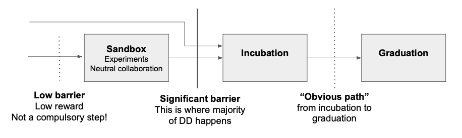

== CNCF Project Proposal Process

=== Introduction 

This governance policy sets forth the proposal process for projects to be accepted into the Cloud Native Computing Foundation (“CNCF”). The process is the same for both existing projects which seek to move into the CNCF, and new projects to be formed within the CNCF.

=== Project stages

=== Sandbox process

See the https://github.com/cncf/toc/blob/master/process/sandbox.md[Sandbox overview] for the definition of and motivation behind the CNCF Sandbox.

. *Project Proposal* 
   * Project proposed through a form [LINK TO BE ADDED] which populates a spreadsheet [LINK TO BE ADDED]
   * Projects may wish to notify the TOC community that they are applying, through a note in the Slack channel or on the mailing list
   * Public comments on the spreadsheet are welcome
   * CNCF staff check submissions for administrative criteria, and advise project maintainers if they don’t currently meet these criteria:
     .. Compliance with IP policy
     .. Project website meets CNCF guidelines
     .. Code of Conduct exist
     .. Contribution guidelines exist 
     .. Public roadmap exists. 
     
* There is a two week cut-off before the TOC submission review meeting, to allow for public comment and for TOC to look at materials. Any submissions after the cut-off simply roll forward to the next review cycle.

. *TOC review meeting*
   * TOC review Sandbox submissions in a meeting every two months 
   * TOC use the following criteria:
     .. Is the project a fit for the CNCF, according to the charter and TOC principles, in the TOC’s opinion? 
     .. Is the project’s roadmap in line with the goals of the CNCF as defined in the charter and TOC principles? 
     .. Does the project appear to be on a good path to becoming well-governed and vendor-neutral? 
   * TOC votes on each submission, and projects will be accepted by a simple majority vote of the TOC. 
   * In the event of rejection, we will indicate which of these criteria the TOC did not believe were met. Projects are welcome to address feedback and submit again in future. Unless advised otherwise, projects should not submit again for six months. 

. *Governance / legal issues*
   * CNCF staff handle governance / legal issues that arise after the vote, but might need to be addressed before project can be admitted (so an acceptance vote is in effect subject to being able to resolve any such issues) 

_Note: original proposal for this Sandbox process is https://docs.google.com/document/d/1IlhqnmhSzs3aTPMkp_75JPYz6LD21aK1sNPrBNruDt0/edit?usp=sharing[here]. 

=== Incubation process

All exceptions (and "no" outcomes) are handled by the TOC.

image::incubation-process.png[Incubation process]

. *Project Proposal* - as for Sandbox
. *TOC Triage* - as for Sandbox
. *SIG Assessment* - as for Sandbox
   * Note that this step is still meant to be a lightweight, pre-DD process
. *TOC Review*
   * TOC review recommendation and presentation
   * TOC may engage with project to ask further questions
. *TOC Incubation Sponsor*
   * If a TOC member steps forward as an Incubation Sponsor, due diligence commences
. *Due Diligence* _2-3 months_
   * TOC Incubation Sponsor drives due diligence (see the https://github.com/cncf/toc/blob/master/process/dd-review-template.md[template] and https://github.com/cncf/toc/blob/master/process/due-diligence-guidelines.md[guidelines]).
   * TOC Incubation Sponsor can delegate DD work to CNCF SIGs and/or other TOC members.
   * TOC Incubation Sponsor can ask project maintainers to complete the DD template as a first pass.
   * CNCF staff do governance and legal DD.
   * During DD some conversations may be held in private (e.g. user interviews where the user wishes to remain anonymous) and are documented using discretion.
   * TOC Incubation Sponsor determines when DD is “done”. DD documentation should then be on GitHub, open to public comment on record.
. *Due Diligence review* _2-6 weeks_
   * DD documents are available for public review and comment (GitHub, TOC mailing list, TOC public meetings)
   * TOC Incubation sponsor decides when to call TOC vote, allowing at least two weeks for public comment before calling vote
. *TOC vote* _up to 6 weeks_
   * TOC members assess whether project meets the https://github.com/cncf/toc/blob/master/process/graduation_criteria.adoc#incubating-stage[Incubation criteria]
   * Projects get accepted to incubation via a 2/3 supermajority vote of the TOC.
   * If the vote is not conclusive after 6 weeks, TOC chair may extend vote, or conclude that silence = abstain

=== Graduation process

. *Submit Graduation Proposal Template*
   * Project fills out and submits the link:graduation-proposal-template.md[graduation proposal template] in a pull request in the https://github.com/cncf/toc[cncf/toc GitHub repo].
   * The file containing the proposal should be located in https://github.com/cncf/toc/tree/master/proposals/graduation[the graduation proposals directory].
   * The proposal addresses how the project has grown since incubation and any concerns from incubation DD in addition to the standard graduation requirements.
. *TOC member kicks off two week period of time for pulic comment on the TOC mailing list*
   * The email should contain a link to the proposal pull request.
   * All SIGs, end users, TOC members, and community members are welcome to comment at this time on the mailing list.
   * Historically, projects have done a TOC presentation as part of the graduation process. The TOC has gotten rid of the presentation requirement. Instead, if the TOC wants to have a deeper discussion about the project with the maintainers, they may schedule an ad hoc meeting to do so before the vote.
. *TOC vote*
   * TOC members assess whether project meets the https://github.com/cncf/toc/blob/master/process/graduation_criteria.adoc#graduation-stage[Graduation criteria]
   * Projects must have a 2/3 supermajority vote of the TOC to graduate

=== Notes

* TOC always has final discretion
* TOC doesn’t have to accept SIG recommendation
* Outcome may be “no” simply because sponsors don’t step forward within the timeframe
* Outcome from TOC Triage or SIG recommendation could be that we want to wait for some reason e.g. project backlogs; batching similar projects together. We should give the project an explanation and set time expectations in these cases.
* All “no” outcomes and other exceptions are discussed by the TOC, and then with project and SIG representatives. We will try to give feedback but it may simply be a lack of conviction in the project.

=== Project Proposal Requirements

Project proposals submitted to the CNCF (see https://github.com/cncf/toc/blob/master/proposals/incubation/kubernetes.adoc[example]) can be written in https://www.markdownguide.org[Markdown], http://asciidoc.org[AsciiDoc], or http://docutils.sourceforge.net/rst.html[reStructuredText] and must provide the following information to the best of your ability:

 .. name of project (must be unique within CNCF)
 .. project description (what it does, why it is valuable, origin and history)
 .. statement on alignment with CNCF charter mission
 .. comparison with similar projects (inside or outside the CNCF), including what differentiates this project
 .. sponsor from TOC (sponsor helps mentor projects)
 .. preferred maturity level (see https://github.com/cncf/toc/blob/master/process/graduation_criteria.adoc[CNCF Graduation Criteria])
 .. license (charter dictates http://www.apache.org/licenses/LICENSE-2.0[Apache 2] by default)
 .. source control (GitHub by default)
 .. external dependencies (including licenses)
 .. initial committers (how long working on project, companies they represent)
 .. infrastructure requests (CI / CNCF Cluster)
 .. communication channels (slack, irc, mailing lists)
 .. issue tracker (GitHub by default)
 .. website (current version will move to project.cncf.io, see https://github.com/cncf/foundation/blob/master/website-guidelines.md[here] for guidelines)
 .. release methodology and mechanics
 .. social media accounts
 .. community size and any existing sponsorship
 .. who is currently known to be using the project? Are they using it in production and at what scale? (It may be hard to obtain accurate data for this, but any supporting evidence of usage is helpful)
 .. project logo in svg format (see https://github.com/cncf/artwork#cncf-related-logos-and-artwork for guidelines)

