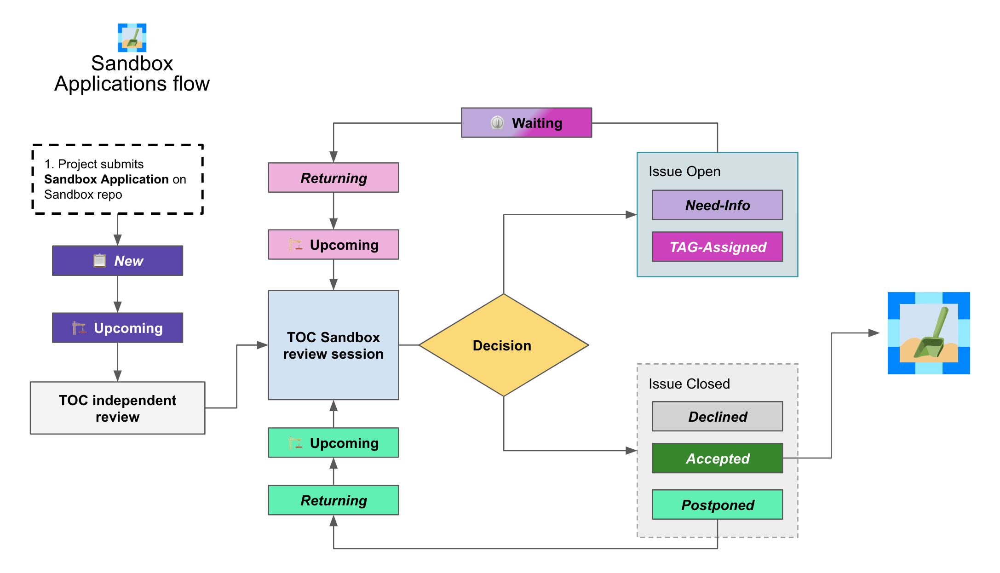

# CNCF Project Proposal Process v1.5

## Introduction 

This governance policy sets forth the proposal process for projects to be accepted into the Cloud Native Computing Foundation (“CNCF”). The process is the same for both existing projects which seek to move into the CNCF, and new projects to be formed within the CNCF.

## Project stages

### Timelines

The TOC makes no guarantees on if/when a project will join the CNCF or move levels.

For sandbox proposals, applications are reviewed from oldest application to newest every two months and the TOC may not have time to get through every application each meeting. The up to date list can be found [here](https://sandbox.cncf.io/) and will be carried over from meeting to meeting if not every one is reviewed.

For moving levels to incubation or graduation, projects should plan on at least 5 months or more between the initial application and approval. Due to the increased community demands around KubeCon + CloudNativeCon, new public comment periods and public votes will not launch within 6 weeks of a KubeCon + CloudNativeCon. Project should take this into account when planning completion of their due diligence.

Q: Why doesn't the TOC get through the sandbox list every meeting?
A: There are currently many projects that want to be a part of the CNCF and it is the TOC's job to carefully consider if they are the right fit for the foundation. This deliberation takes times and there are only so many applications that the TOC can get through each meeting. If anything, a delay from one meeting to the next is a benefit for the project because it allows more time to build community support.

Q: Exactly how long will it take my project to move levels once my application is in?
A: Just like in open source, it will get done when the work is done. This can range from 5 months to 15 months please coordinate with your TOC sponsor to keep everything on track.

Q: Can my project still apply to move levels within 6 weeks of KubeCon?
A: Yes, though getting a TOC sponsor, conducting any due dilligence, and any other steps of the process will be delayed until after KubeCon.

Q: Why can't public comment periods or votes launch within 6 weeks of a KubeCon?
A: Undergoing due diligence is non-insignificant amount of work. Conducting adopter interviews takes time and scheduling becomes increasingly difficult the closer to each KCCN we get. Being able to successfully complete due diligence to launch the public part of the process becomes very difficult as many community members have additional responsibilites related to the conference. By removing KCCN as a goal post for brand new requests to move levels, we hope to not burn out adopters, TOC, maintainers, and other community members.

### Sandbox process

**Note: The TOC has changed the sandbox application process to a more transparent and streamlined workflow within the :package: [Sandbox Applications repository](https://github.com/cncf/sandbox) :package:.**

All exceptions and "declined" or "postponed" outcomes are handled by the TOC. Projects may be encouraged to re-apply after addressing areas called out in the application comments on the corresponding issue. Please refer to the instructions in the [Sandbox repo README](https://github.com/cncf/sandbox) for more details on re-application.

#### Applying for Sandbox
   * Projects apply for sandbox through the Sandbox Repo's *[Issue Form](https://github.com/cncf/sandbox/issues/new)*. More information on this process is found on the main [Sandbox repo page](https://github.com/cncf/sandbox).

#### Annual Review of Sandbox projects

Once in the Sandbox, projects are subject to an [Annual Review](https://github.com/cncf/toc/blob/master/process/sandbox-annual-review.md).
 
#### Governance / legal issues* 
   * CNCF staff handle governance / legal issues
   * Projects are encouraged to participate/attend TOC meetings and reach out to TAGs for advice or scheduling presentations and discussions.

See the [Sandbox guidelines](https://github.com/cncf/toc/blob/main/process/sandbox.md) for the definition of and motivation behind the CNCF Sandbox.

### Incubation process

Note: We have [streamlined the Incubation process](https://docs.google.com/presentation/d/1J9nti4JdiwLHxY15KtkmqyfP4OgNfrLAd3vxPvFTzsc/edit?usp=sharing).

All exceptions (and "no" outcomes) are handled by the TOC.

#### Project Proposal
   * Incubation proposed through a [GitHub pull request](https://github.com/cncf/toc/pulls)
   * The proposal moves to Due Diligence when a TOC member steps forward as an Incubation Sponsor - Please avoid contacting TOC members individually to serve as project sponsor.
   * The status of outstanding Incubation proposals is reported on a monthly basis in the TOC public meeting. This highlights projects looking for sponsorship, and provides a check-in on DD progress for sponsored projects. 
   * A potential sponsor can indicate that they are interested but don't have capacity to work on DD at this time, to set a project's expectations.
   * The TOC may agree that the project does not (yet) meet the [Incubation requirements](https://github.com/cncf/toc/blob/main/process/graduation_criteria.md#incubation-stage) and give feedback on why this is the case. If the project is not already in the CNCF, the TOC may suggest that project apply for Sandbox instead.
   * If a TOC Incubation Sponsor has not stepped forward within two months after the proposal PR is submitted, projects may request that their project proposal is discussed at a forthcoming TOC meeting by adding it to the [Working Doc](https://docs.google.com/document/d/1jpoKT12jf2jTf-2EJSAl4iTdA7Aoj_uiI19qIaECNFc/edit). The outcome of this is discussion is either that a sponsor steps forward, or that the TOC votes to admit the project to Sandbox, or the proposal is rejected (projects may reapply after six months). If, even after all those steps, a sponsor does not step forward, the proposal is rejected. 
   * DD will usually involve a presentation to a TAG, but an interested TAG is welcome to schedule a project presentation at any time. TAGs can discuss their recommendations or concerns about a project with their TOC liaison(s) if there isn't already a TOC Incubation Sponsor in place. 
   * Although it is not necessary, projects are allowed to informally reach out to TOC members for advice, including asking about potential sponsorship. TOC members should keep each other informed about these approaches so that we can avoid falling prey to "lobbying" (directly contacting a TOC member to volunteer or manage an action or issue). There is a fine line between a project asking for help to make a successful application, and a project shopping around looking to pressurize a TOC member into sponsorship. 
. *TOC Incubation Sponsor* 
   * TOC Incubation Sponsor is responsible for driving the process, and co-ordinating with TAGs for review and input as they see fit. 
   * TOC Incubation Sponsor is a point of contact for the project throughout the process.
   * TOC members may not sponsor a project for which they have a clear conflict of interest (for example, originating primarily from their organization). This doesn't mean that they can't have any involvement at all - for example, contributing pull requests, or being an [adopter](https://github.com/cncf/toc/blob/main/FAQ.md#what-is-the-definition-of-an-adopter) of that project, can signal a healthy interest in and knowledge of a worthwhile project. 
. *Due Diligence* _2-3 months_
   * TOC Incubation Sponsor drives due diligence (see the [template](https://github.com/cncf/toc/blob/main/process/dd-review-template.md) and [guidelines](https://github.com/cncf/toc/blob/main/process/due-diligence-guidelines.md)).
   * TOC Incubation Sponsor can delegate DD work to CNCF TAGs and/or other TOC members.
   * Typically DD includes a presentation to a CNCF TAG, as identified by the TOC Sponsor. This step may be omitted if the TOC Sponsor feels there are readily-available and suitable presentations on video - for example, because the TAG has already recently held a presentation. (We do not want unnecessary levels of process or bureaucracy to delay a widely-known and adopted project from joining the CNCF). TOC Sponsor has discretion to arrange alternatives (for example, arranging a Q&A session at a TOC meeting) to ensure there is ample opportunity to ask questions.
   * TOC Incubation Sponsor can ask project maintainers to complete the DD template. (In practice project maintainers sometimes choose to make a start on this in advance of the official DD process, or even in advance of the initial proposal as it may help them ensure they meet all the requirements.) The TOC Incubation Sponsor should carefully review and ask questions about the DD as prepared by the project maintainers, and may also call on TAGs to help with this. 
   * CNCF staff do governance and legal DD.
   * During DD some conversations may be held in private (e.g. adopter interviews where the adopter wishes to remain anonymous) and are documented using discretion.
     * TOC members are not required to identify the kind of direct adopter an interviewed organization is, rather they should use their discretion and the guidelines defined in the [FAQs](https://github.com/cncf/toc/blob/main/FAQ.md#what-is-the-definition-of-an-adopter) for selected organizations to be interviewed and the nature of the interview as it best assists projects, this may include conducting a combined interview of direct and transitive adopters to ascertain maturity and interaction.
   * TOC Incubation Sponsor confirms that project meets the [Incubation requirements](https://github.com/cncf/toc/blob/main/process/graduation_criteria.md#incubating-stage).
   * TOC Incubation Sponsor determines when DD is “done”. DD documentation should then be on GitHub, open to public comment on record.
. *Due Diligence review* _2-6 weeks_
   * TOC Incubation Sponsor announces on the TOC mailing list when the DD documents are available for public review and comment, which can take place on GitHub, the TOC mailing list, or at TOC public meetings. 
   * TOC Incubation sponsor decides when to call TOC vote, allowing at least two weeks for public comment before calling vote
. *TOC vote* _up to 6 weeks_
   * TOC members assess whether project meets the [Incubation criteria](https://github.com/cncf/toc/blob/main/process/graduation_criteria.md#incubating-stage)
   * Projects get accepted to incubation via a 2/3 supermajority vote of the TOC.
   * If the vote is not conclusive after 6 weeks, TOC chair may extend vote, or conclude that silence = abstain

### Graduation process

#### Submit Graduation Proposal Template
   * Project fills out and submits the [graduation proposal template](graduation-proposal-template.md) in a pull request in the [cncf/toc GitHub repo](https://github.com/cncf/toc).
   * The file containing the proposal should be located in [the graduation proposals directory](https://github.com/cncf/toc/tree/main/proposals/graduation).
   * The proposal addresses how the project has grown since incubation and any concerns from incubation DD in addition to the standard graduation requirements.
   * Projects will be reviewed on a rolling basis as they apply, instead of two meetings a year.    
. * If a TOC member steps forward to support the project as a sponsor and determines the Graduation DD document is finalized, the TOC member kicks off two week period of time for public comment on the TOC mailing list
   * Please avoid contacting TOC members individually to serve as project sponsor.
   * The email should contain a link to the proposal pull request and graduation DD document.
   * All TAGs, adopters, TOC members, and community members are welcome to comment at this time on the mailing list.
   * Historically, projects have done a TOC presentation as part of the graduation process. The TOC has gotten rid of the presentation requirement. 
* If the TOC does not sponsor the project to move forward at that time, they will provide feedback to the project and the PR will be closed. 
* If the Graduation DD document is not finalized, the TOC sponsor will begin the process to refresh the existing DD document and begin the public comment process.

#### TOC vote
   * TOC members assess whether project meets the [Graduation criteria](https://github.com/cncf/toc/blob/main/process/graduation_criteria.md#graduation-stage)
   * Projects must have a 2/3 supermajority vote of the TOC to graduate

### Notes

* TOC always has final discretion
* TOC doesn’t have to accept TAG recommendation
* Outcome may be “no” simply because sponsors don’t step forward within the timeframe
* Outcome from TOC Triage or TAG recommendation could be that we want to wait for some reason e.g. project backlogs; batching similar projects together. We should give the project an explanation and set time expectations in these cases.
* All “no” outcomes and other exceptions are discussed by the TOC, and then with project and TAG representatives. We will try to give feedback but it may simply be a lack of conviction in the project.
* If the project is concerned about the timeline, feels they have waited too long, or needs to reach out, please reach out to the TOC via one of their mailing lists or contact the CNCF Staff.
* Projects are encouraged to participate/attend TOC meetings and reaching out to TAGs for advice or scheduling presentations and discussions.

