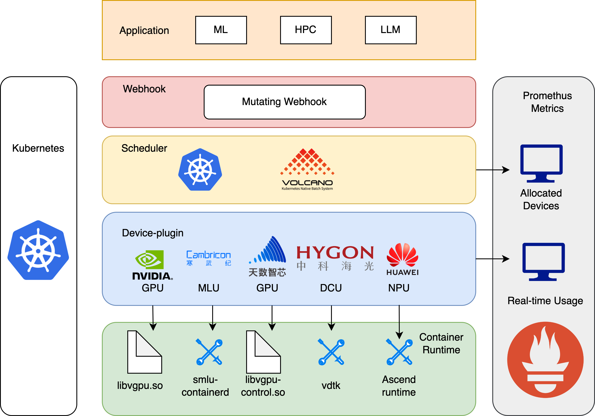
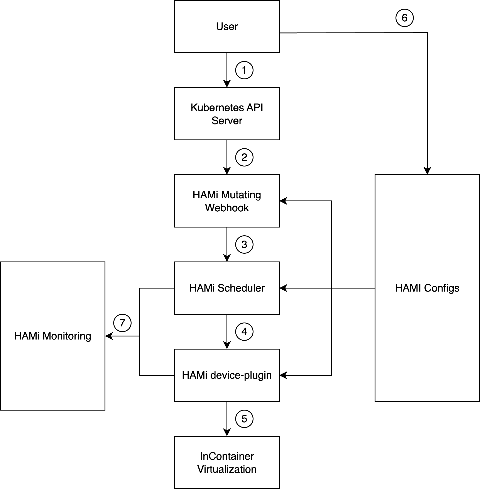

# HAMi Security Self-Assessment

This self-assessment was created by the HAMi project team as part of the CNCF Incubation process and in alignment with the [CNCF TAG-Security Self-Assessment Guide](https://tag-security.cncf.io/community/assessments/guide/self-assessment/).

## Table of contents

- [Metadata](#metadata)
- [Security links](#security-links)
- [Overview](#overview)
  - [Background](#background)
  - [Actors](#actors)
  - [Actions](#actions)
  - [Goals](#goals)
  - [Non-goals](#non-goals)
- [Self-assessment use](#self-assessment-use)
- [Security functions and features](#security-functions-and-features)
  - [Critical](#critical)
  - [Security Relevant](#security-relevant)
- [Project compliance](#project-compliance)
- [Secure development practices](#secure-development-practices)
  - [Development Pipeline](#development-pipeline)
  - [Communication Channels](#communication-channels)
  - [Ecosystem](#ecosystem)
- [Security issue resolution](#security-issue-resolution)
  - [Responsible disclosure](#responsible-disclosure)
  - [Vulnerability response process](#vulnerability-response-process)
  - [Incident Response](#incident-response)
- [Appendix](#appendix)
  - [Known Issues Over Time](#known-issues-over-time)
  - [Open SSF Best Practices](#open-ssf-best-practices)
  - [Case Studies](#case-studies)
  - [Related Projects / Vendors](#related-projects--vendors)

---

## Metadata

| | |
| -- | -- |
| Assessment Stage | Complete |
| Software | https://github.com/Project-HAMi/HAMi |
| Security Provider | No |
| Languages | Go, Shell, C |
| SBOM | https://github.com/Project-HAMi/community/blob/main/sbom.md |

### Security links

| Doc | url |
| -- | -- |
| Security policy / vulnerability reporting | https://github.com/Project-HAMi/HAMi/security/policy |
| SECURITY.md | https://github.com/Project-HAMi/HAMi/blob/master/SECURITY.md |
| Default and optional configs | https://github.com/Project-HAMi/HAMi/blob/master/docs/config.md |
| Governance | https://github.com/Project-HAMi/community/blob/main/governance.md |
| Code of Conduct | https://github.com/Project-HAMi/community/blob/main/CODE-OF-CONDUCT.md |
| Maintainers & contacts | https://github.com/Project-HAMi/HAMi/blob/master/MAINTAINERS.md |

---

## Overview

HAMi (Heterogeneous AI Computing Virtualization Middleware) is a Kubernetes-native middleware for managing and virtualizing heterogeneous AI devices (GPUs, NPUs, MLUs, etc.). It provides device sharing, resource isolation, and scheduling so that [workloads receive only the device resources they are allocated, with no application code changes].

### Background

HAMi addresses the need to share expensive heterogeneous accelerators (e.g., NVIDIA GPUs, Huawei Ascend, Cambricon MLU, Hygon DCU) across multiple pods while enforcing hard limits on device memory and compute. It integrates with the Kubernetes scheduler via a scheduler extender. Device plugins register node capacity and device types, it also injects in-container virtualization library into pods; in-container virtualization (e.g., NVIDIA time-slicing, vendor-specific libraries) enforces isolation at runtime. The project is used in production across internet, cloud, finance, manufacturing, and education, and is a [CNCF Sandbox project](https://landscape.cncf.io/?item=orchestration-management--scheduling-orchestration--hami) applying for [Incubation](https://github.com/cncf/toc/issues/1775).

### Actors

**Users**: Individuals or systems that interact with HAMi for job management. This could include administrators who configure the system, users who submit jobs, and any external systems that interface with HAMi.

**Kubernetes API Server**: While HAMi operates within kubernetes, It uses kubernetes API server to handles requests and responses between users and the HAMi scheduler. It’s a critical interface and thus a separate actor due to its role in processing and validating job submissions.

**Scheduler Extender (hami-scheduler)**  
hami-scheduler uses scheduler-extender to perform device-specified filter and Score.
It registers to default Kubernetes scheduler, and is called during Filter and Score phase. hami-scheduler holds a view of node devices and pod allocations, and decides which nodes can fit device requests. It is isolated as a separate service; compromise could affect scheduling decisions but never in-container isolation.

**Mutating Webhook**  
Running as part of the scheduler deployment and mutates pods before admission to add 'schedulerName: hami-scheduler' to each pod it manages. It must be configured with TLS (self-signed or cert-manager, or SPIFFE/SPIRE). Compromise could lead to job failure.

**Device Plugins (e.g., hami-device-plugin)**  
Run on each node, register device resources with the kubelet, and respond to Allocate requests. During initialization, they interact with vendor drivers to query the specs of each devices, patch them in node annotations for scheduler to access. They also extract in-container virtualization library, and put them in a hostpath, for it can be later mounted in a GPU container. Compromise could affect which devices are exposed to which pods or allow escape from resource limits if combined with a bug in in-container enforcement.

**In-Container Virtualization Libraries**  
Per-device-type components (e.g., libvgpu for NVIDIA, vendor-specific libs for Ascend, MLU) run inside the container and enforce memory/core limits. They are critical for isolation; a flaw could allow a workload to exceed its quota or affect other tenants on the same device. In worst case, it could crash a pod.

**Cluster Administrators and End Users**  
Admins deploy HAMi, configure policies, and manage nodes; users submit workloads with resource requests. Access is governed by Kubernetes RBAC and cluster trust boundaries.

### Actions

Actions describe the interaction flows between users/systems and HAMi, and the role of each component in those flows.

#### 1. User interaction with HAMi: Job Submission

Users (or controllers such as Job operators) create or update Pods that request HAMi-managed resources (e.g. `nvidia.com/gpu`, `nvidia.com/gpumem`, `nvidia.com/gpucores`). The request is sent to the Kubernetes API server.

- **Involved actors:** End User (or Job controller), Kubernetes API Server
- **Security checks and system actions:**
  - **Authentication:** Kubernetes API server authenticates the user or service account before accepting the Pod create/update.
  - **Authorization:** Kubernetes RBAC verifies that the principal has permission to create Pods (and optionally to use device resources in the namespace).

#### 2. HAMi webhook operations: Pod admission and mutation

When a Pod is created or updated, the Kubernetes API server sends it to the HAMi mutating webhook (if the webhook is configured for the resource). The webhook identifies pods that request HAMi-managed resources, optionally validates resource fields, and patches the pod (e.g. scheduler name. It may reject pods that request privileged containers.

- **Involved actors:** Kubernetes API Server, HAMi Mutating Webhook
- **Security checks and system actions:**
  - **TLS:** API server communicates with the webhook over TLS; trust is established via the webhook certificate (self-signed or from cert-manager).
  - **Validation:** Resource request format and values are validated where applicable to avoid malformed allocations.
  - **Deterministic mutation:** Webhook only adds or updates defined fields (scheduler name, container resources); it does not inject arbitrary or user-controlled content into the pod spec beyond what is required for device allocation.

#### 3. HAMi scheduler extender operations: Filter and Score

The Kubernetes scheduler sends Filter and Score requests to the HAMi scheduler extender for each candidate node. The extender consults its view of node device capacity, current allocations, and pod annotations (e.g. device type, UUID allow/deny lists) to decide whether the pod can be placed on the node and to compute a score.

- **Involved actors:** HAMi Scheduler Extender, Kubernetes API Server (as source of node and pod data)
- **Security checks and system actions:**
  - **Consistency of device state:** Extender uses device usage and capacity data consistent with what device plugins and the scheduler have recorded; prevents over-allocation.
  - **Annotation enforcement:** Pod annotations (e.g. `nvidia.com/use-gpuuuid`, `nvidia.com/nouse-gpuuuid`, device type) are enforced so that placement respects admin and user constraints.
  - **Quota and health:** Extender checks device health and remaining quota (memory, cores, time-slicing count) so that only valid placements are returned.
  - **No workload data access:** Extender operates on pod spec and node device metadata only; no access to workload payload or user data.

#### 4. Device plugin operations: Resource allocation (Allocate)

After the scheduler has bound the Pod to a node, the kubelet on that node calls the HAMi device plugin's Allocate RPC for each container that requests the plugin's resources. The plugin returns device IDs, mount points, and environment variables (e.g. `NVIDIA_VISIBLE_DEVICES`) so that the container sees only the vGPUs allocated to it by the scheduler. It also responsible for mounting the In-Container Virtualization Libraries(e.g. `libvgpu.so`) into container.

- **Involved actors:** HAMi Device Plugin (on the node), Kubernetes API Server (allocation state), In-Container Virtualization Libraries
- **Security checks and system actions:**
  - **Allocation consistency:** Plugin allocates only the devices and quantities that the scheduler has recorded for this pod/container; allocation state is consistent with scheduler view.
  - **Isolation of device exposure:** Response limits the container to the assigned device IDs and (where used) CDI or env-based visibility so that the workload cannot see or use other devices on the node.
  - **Kubelet–plugin channel:** Communication between kubelet and plugin uses the Kubernetes device plugin protocol; node-level trust boundary is the same as for other device plugins.
  - **Mounting in-container virtualization layer** Mount the virtualization library into container with proper setup

#### 5. Runtime: Container execution with device isolation

The container runs on the node with the devices and env configured by the device plugin. In-container components (e.g. libvgpu for NVIDIA, vendor libraries for Ascend/MLU) intercept device API calls and enforce memory and core limits so that the workload cannot exceed its allocated share.

- **Involved actors:**  HAMi in-container virtualization Libraries
- **Security checks and system actions:**
  - **Resource enforcement:** In-container libraries enforce hard limits on device memory and compute usage; violations are blocked or throttled so that one pod cannot consume more than its quota.
  - **Isolation between tenants:** Multiple pods sharing the same physical device are isolated by these limits; a flaw in enforcement could allow cross-tenant impact and is therefore a critical component.

#### 6. Administrator interaction with HAMi: Configuration and management

Cluster administrators install HAMi (e.g. via Helm), configure device and node settings via ConfigMaps (e.g. `hami-scheduler-device`, `hami-device-plugin`), and manage node labels and node-level device filters. They may also configure webhook TLS (e.g. cert-manager) and RBAC for HAMi components.

- **Involved actors:** Cluster Administrator, Kubernetes API Server, HAMi Helm charts / manifests, ConfigMaps, HAMi Scheduler, HAMi Device Plugin
- **Security checks and system actions:**
  - **Authentication and authorization:** Only principals with sufficient Kubernetes RBAC permissions can create or update HAMi ConfigMaps, node labels, and HAMi deployments.
  - **Configuration validation:** Helm and documentation describe valid values; misconfiguration can affect scheduling or allocation but is not a direct code vulnerability.
  - **Principle of least privilege:** HAMi components should be granted only the API permissions they need; deployment docs and defaults should encourage minimal RBAC.
  - **Secure defaults:** Defaults (e.g. device split count, default memory/cores) should be safe for typical use; sensitive options (e.g. license paths, overcommit) are documented so admins can assess risk.

#### 7. Observability: Metrics and monitoring

Operators and admins consume metrics (e.g. device usage, allocation counts per node) exposed by the HAMi scheduler and optionally use the HAMi WebUI for cluster device overview. No sensitive workload data or user content is stored or exposed.

- **Involved actors:** Cluster Operator / Administrator, HAMi Scheduler (metrics endpoint), optional HAMi WebUI, Prometheus (or similar)
- **Security checks and system actions:**
  - **Metrics scope:** Exposed metrics describe device and allocation state, not workload payload or user data.
  - **Access control:** Metrics endpoint and WebUI access should be restricted by network policy or ingress RBAC as appropriate so that only authorized operators can view cluster device usage.

### Goals

- **Preventing resource leakage:** Processes running in containers cannot change the container's device memory, compute, or visible GPUs by modifying environment variables or config files.
- **Gradual rollout:** Upgrading or uninstalling HAMi components does not affect workloads that have already been started by HAMi.
- **Fault isolation:** A failure of one GPU workload does not affect other workloads sharing the same GPU.

### Non-goals

- **Privileged containers:** HAMi does not schedule privileged tasks (`privileged: true`), because such tasks always see all GPU devices regardless of resource configuration; privileged containers fall back to the default scheduler.

---

## Self-assessment use

This self-assessment is created by maintainers of HAMi community to perform an internal analysis of the project's security. It is not intended to provide a security audit of HAMi, or function as an independent assessment or attestation of HAMi's security health.

This document serves to provide HAMi users with an initial understanding of HAMi's security, where to find existing security documentation, HAMi's plans for security, and a general overview of HAMi security practices, both for development of HAMi and security of HAMi.

This document provides the CNCF TAG-Security with an initial understanding of HAMi to assist in a joint-assessment, necessary for projects under incubation. Taken together, this document and the joint-assessment serve as a cornerstone for if and when HAMi seeks graduation and is preparing for a security audit.

---

## Security functions and features

### Critical

**Webhook admission**  
The mutating webhook adds schedulerName to managed pods. It must not inject arbitrary or attacker-controlled content; validation and patch logic are security-sensitive. Privileged container checks reduce risk of privilege escalation.
**Scheduler extender logic**  
The scheduler extender enforces fit and score based on device capacity, health, quota, and annotations. Correctness is critical so that allocations are consistent with actual device state and no over-allocation occurs. Bugs could lead to oversubscription or incorrect placement.
**Device plugin allocation**  
Device plugins must allocate only the devices and quantities that the scheduler has recorded for the pod. Mismatch could expose more devices than intended or break isolation assumptions.
**In-container resource enforcement**  
Vendor-specific in-container components (e.g., libvgpu for NVIDIA) enforce memory and core limits. These are the primary isolation mechanism; a flaw could allow a workload to exceed its quota or affect co-located workloads.

### Security Relevant

**Webhook TLS**  
The webhook supports self-signed certs (e.g., via kube-webhook-certgen) or cert-manager. Proper TLS and API server trust are required to prevent MITM or injection.
**ConfigMap and Helm configuration**  
Device and node configs (e.g., `nvidia.deviceSplitCount`, `nvidia.defaultCores`, node-level overrides) affect scheduling and allocation. Restricting write access to these configs (e.g., via RBAC) is important.
**RBAC for HAMi components**  
Scheduler and device plugin need read/write access to nodes, pods, and possibly configmaps; principle of least privilege should be applied and documented in deployment guides.
**Container images**  
Official images are built in CI; Trivy scanning is used (e.g., in commercial image workflow). Image provenance and signing are areas for continued improvement.

---

## Project compliance

Not Applicable.

---

## Secure development practices

### Development Pipeline

- **CI:** GitHub Actions run on push and pull_request: license check, `go mod tidy`, golangci-lint, import alias checks, unit tests (`make test`), coverage upload to Codecov for the main repo. E2E and build run when code (excluding docs/examples) changes.
- **Testing:** Unit tests for device logic, scheduler, and webhook; E2E for integration. Contributors are asked to add tests for new code.
- **Code review:** HAMi employs a rigorous code review process, with multiple maintainers from different organizations and automated checks, as well as AI assistance. This ensures high standards of code quality and security.
- **AI assistance:** Contributors must disclose AI assistance in PRs; undisclosed use is not acceptable.
- **Code Signing:** The project requires DCO as part of PR checks, all commits must be signed-off before integrated.
- **Code Protection:** Forbid directly commits, all codes modification must be done with PR.
- **SBOM and attestations:** SBOM is documented in [community](https://github.com/Project-HAMi/community/blob/main/sbom.md). The project is evaluating or adopting supply-chain attestations (e.g., in-toto, SLSA) where applicable.

### Communication Channels

- **Internal:** Maintainers coordinate via Slack, Wechat, Emails and Google Docs for agendas and notes. See [README Meeting & Contact](https://github.com/Project-HAMi/HAMi#meeting--contact).
- **Inbound:** GitHub Issues ([new issue](https://github.com/Project-HAMi/HAMi/issues/new/choose)), CNCF Slack (#hami), regular community meetings, and maintainer emails in MAINTAINERS.md. Security-sensitive reports should use [GitHub Security Advisories](https://github.com/Project-HAMi/HAMi/security/advisories/new).
- **Outbound:** Release notes and tags on GitHub, project [website](https://project-hami.io/) and [blog](https://project-hami.io/blog), and community meetings. Security advisories are published via GitHub when applicable.

### Ecosystem

HAMi fits into the cloud native ecosystem as a **scheduling and device virtualization** layer for Kubernetes:

- **Kubernetes:** Uses scheduler extender and admission webhook APIs; compatible with default kube-scheduler.
- **CNCF:** Sandbox project on the [CNCF Landscape](https://landscape.cncf.io/?item=orchestration-management--scheduling-orchestration--hami) and [CNAI Landscape](https://landscape.cncf.io/?group=cnai&item=cnai--general-orchestration--hami); applying for Incubation.
- **Integrations:** Documented integration with [Volcano](https://github.com/volcano-sh/volcano/blob/master/docs/user-guide/how_to_use_gpu_sharing.md) and [Koordinator](https://koordinator.sh/docs/user-manuals/device-scheduling-gpu-share-with-hami/). Supports multiple device vendors (NVIDIA, Huawei Ascend, Cambricon, Hygon, Iluvatar, Moore Threads, Enflame, MetaX, etc.).

---

## Security issue resolution

The HAMi project has a Product Security Team (PST) responsible for handling security vulnerabilities, coordinating responses, and organizing both internal communication and external disclosure.

### Responsible disclosure

- HAMi encourages responsible disclosure and asks that security vulnerabilities **not** be disclosed publicly before coordination with the project.
- Reporting is via **GitHub Security Advisories**: [Submit a private vulnerability report](https://github.com/Project-HAMi/HAMi/security/advisories/new).

### Vulnerability response process

- **Ownership:** Maintainers (see [MAINTAINERS.md](https://github.com/Project-HAMi/HAMi/blob/master/MAINTAINERS.md)) are responsible for triage and response.
- **Process:** Reports are handled privately via GitHub Security Advisories. Maintainers aim to respond within about 48 hours; response times may vary with weekends, holidays, and time zones.
- **Triage:** Severity and impact are assessed; fixes are developed and released for supported versions. Security advisories are published when appropriate.

### Incident Response

The PST follows a structured process for patching, releasing, and publicly communicating about vulnerabilities. This includes creating a CVSS score, developing fixes, and coordinating with the community and distributors for patch releases and announcements.

---

## Appendix

### Known Issues Over Time

No Active issues found.
- [Issues solved](https://github.com/Project-HAMi/HAMi/pulls?page=1&q=is%3Apr+security+is%3Aclosed)

### Badges

- [HAMi has achieved an Open Source Security Foundation (OpenSSF) best practices badge at passing level.](https://www.bestpractices.dev/en/projects/9416)
- [HAMi has achieved A+ quality as an open source Go project.](https://goreportcard.com/report/github.com/Project-HAMi/HAMi)

### Case Studies

- [Scaling machine learning infrastructure with GPU virtualization using Kubernetes and HAMi](https://www.cncf.io/case-studies/ke-holdings-inc/)
- [Building flexible GPU clouds with HAMi at DaoCloud](https://www.cncf.io/case-studies/daocloud/)
- [Effective GPU: A Heterogeneous AI Virtualization Pooling solution by SF technology built on top of HAMi](https://www.cncf.io/case-studies/sf-technology/)
- [Enabling Efficient GPU Orchestration for AI Inference at PREP EDU](https://www.cncf.io/case-studies/prep-edu/)

### Related Projects

- [Volcano vGPU](https://github.com/volcano-sh/volcano/blob/master/docs/user-guide/how_to_use_volcano_vgpu.md)
- [Koordinator vNPU](https://koordinator.sh/docs/user-manuals/device-scheduling-gpu-share-with-hami)

---

*Last updated: 2025-03. For the latest security policy and supported versions, see [SECURITY.md](https://github.com/Project-HAMi/HAMi/blob/master/SECURITY.md) and [security/policy](https://github.com/Project-HAMi/HAMi/security/policy).*
