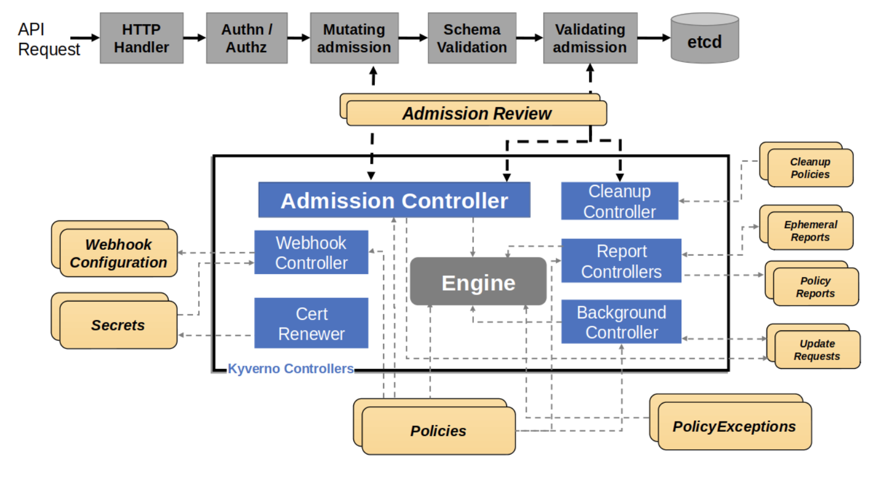
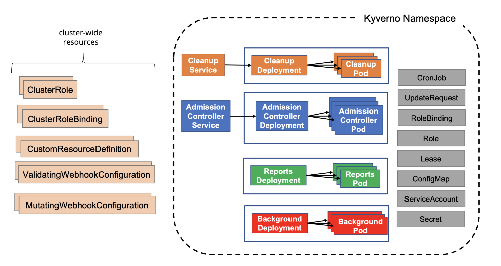

# CNCF TAG-Security and Compliance: Kyverno Security Joint Assessment

[Self-assessment source](https://github.com/cncf/toc/blob/main/projects/kyverno/security-assessment/self-assessment.md)

| Completed: | tbd |
| :---- | :---- |
| **Security reviewer(s)**: | Andrew Martin, John Kinsella, Wesley Steehouwer (@dutchshark), Robert Ficcaglia, Tom Cope, Giovanni Baggio, Justin Cappos |
| **Project security lead**: | Jim Bugwadia, Shuting Zhao |
| **Source code**: | <https://github.com/kyverno/kyverno> |
| **Web site**: | <https://kyverno.io/> |
| **Changes tracking issue**: | <https://github.com/kyverno/kyverno/issues/15335>  |

# Table of contents

* [Metadata](#metadata)
  * [Security links](#security-links)
* [Overview](#overview)
  * [Background](#background-on-kubernetes-controllers)
  * [Goals](#goals)
  * [Non-goals](#non-goals)
* [Joint-assessment use](#joint-assessment-use)
* [Project Design](#project-design)
  * [Design](#design)
    * [Admission Controller](#admission-controller)
    * [Reports Controller](#reports-controller)
    * [Background Controller](#background-controller)
    * [Cleanup Controller](#cleanup-controller)
  * [Data flow diagram/Architecture diagram](#data-flow-diagram/architecture-diagram)
  * [Functions and features](#functions-and-features)
    * [Critical](#critical)
    * [Relevant](#relevant)
    * [Threat Modeling](#threat-modeling)
* [Project compliance](#project-compliance)
  * [Existing Audits](#existing-audits)

## Metadata

| Key | Value |
| :---- | :---- |
| Software | <https://github.com/kyverno/kyverno> |
| Security Provider | Yes |
| Languages | Go |
| SBOM | To download and verify the SBOM for a specific version, visit <https://kyverno.io/docs/security/#fetching-the-sbom-for-kyverno> |
| Compatibility | <https://kyverno.io/docs/installation/#compatibility-matrix> |

### Security links

| Doc | url |
| :---- | :---- |
| Kyverno Security Documentation | <https://main.kyverno.io/docs/security/> |

## Overview

Kyverno helps secure and automate configurations using policies defined as Kubernetes custom resources. It operates as a Kubernetes admission controller and provides command-line tools for off-cluster use. 

Additionally, Kyverno has been extended with new policy types (`ValidatingPolicy`, `ImageValidatingPolicy`, `MutatingPolicy`) that utilize CommonExpressionLanguage (CEL) to support non-Kubernetes resources, enabling policy validation for any JSON or YAML payload including Terraform files, Dockerfiles, cloud configurations, and service authorization requests.

### Background on Kubernetes Controllers

Kubernetes has a declarative configuration management system that allows users to specify the desired state of resources, in which controllers continuously reconcile with the current system state. For flexibility, and to address a wide set of use cases, Kubernetes provides [several configuration options][google-search-k8s-api] for each resource.

[google-search-k8s-api]: https://www.google.com/url?q=https://kubernetes.io/docs/reference/generated/kubernetes-api/v1.34/&sa=D&source=docs&ust=1772478640469573&usg=AOvVaw0ovpqALGHS1xQdKiFR1aI2

While this is powerful, it also creates a few challenges:

1. Only a small subset of Kubernetes controller configuration options are commonly used, and configuration details may be overlooked. For example, a developer may not know how to properly configure a pod’s Security Context.
2. The wide range of possible configurations also increases managerial overhead, as it can result in a lack of standardization.
3. Kubernetes configurations are not secure by default (e.g. no default network policy, Pod Security Standards, open RBAC). Security and best practices need to be configured for workloads and users.
4. A Kubernetes resource's configuration may be shared across organizational roles (DevSecOps) and chances of misconfigurations, or lack of proper configuration, increase as if is no clear resource ownership between teams. Whether developers, operators, or security engineers are responsible for more _advanced_ configuration settings may not be obvious.

### Goals

Kyverno’s goal is to enforce security, operational, and best practices policies across Kubernetes resources to prevent insecure configurations and ensure compliance through user-defined policies. User-defined YAML and CEL policies are enforced through admission control to prevent non-compliant Kubernetes resources from being created or modified, providing immediate feedback to users. If the admission controller is not installed as an admission controller (or otherwise unavailable at runtime), CLI tools and background scanning provide alternative enforcement mechanisms to maintain security posture. 

Kyverno also provides automation through mutation and generation capabilities to automatically update workload configurations, or security and operational best practices, and create required resources, simplifying security management. CLI tools extend this enforcement to non-Kubernetes environments e.g., CI/CD pipelines, and allow policies to be applied to resources like Terraform files and Dockerfiles.

### Non-goals

Kyverno is only able to impact the policies used by Kubernetes and is NOT designed to address Kubernetes security flaws that are inherent in its design.  For example, it cannot protect against vulnerabilities in the Kubernetes API server (e.g. Billion Laughs YAML deserialization, or correct Kubernetes Admission Controller implementation) or underlying infrastructure and Kyverno's policy enforcement may be bypassed if Kubernetes has a security flaw. Kyverno does not enforce security requirements that weren't explicitly defined, it enforces only the policies that users define and must be actively maintained like any other security product. 

Kyverno does not replace, but works in conjunction with, Kubernetes RBAC, as RBAC controls access while Kyverno enforces policy compliance. Cluster admins are expected to use RBAC to manage user and service account authorization, and then leverage Kyverno for additional checks which cannot be performed by RBAC. 

Kyverno also does not replace Kubernetes' built-in policy controls like ValidatingAdmissionPolicies and MutatingAdmissionPolicies, but complements these native controls with additional features such as comprehensive reporting, exception management, and periodic scanning.

## Joint-assessment use

The joint assessment is initially created by the project team and then collaboratively developed with the [security reviewers](https://tag-security.cncf.io/community/assessments/guide/security-reviewer/) as part of the project’s TAG-Security Security Assessment (TSSA) Process. Information about the TAG-Security Review can be found in the [CNCF TAG-Security Review Process Guide](https://tag-security.cncf.io/community/assessments/guide/).

This document does not intend to provide a security audit of Kyverno and is not intended to be used in lieu of a security audit. This document provides users of Kyverno with a security focused understanding of Kyverno and when taken with the [self-assessment](https://tag-security.cncf.io/community/assessments/guide/self-assessment/) provide the community with the TAG-Security Review of the project. Both of these documents may be used and references as part of a security audit.

## Project Design

### Design

The following diagram shows the logical architecture for Kyverno. Each major component is described below:

Kyverno consists of four main controllers that work together to provide comprehensive policy management capabilities. Each controller handles specific aspects of policy processing, from admission control to background operations and cleanup tasks.

#### Admission Controller

* Receives `AdmissionReview` requests from the Kubernetes API server through validating and mutating webhooks.
* Processes validate, mutate, and image validating rules.
* Manages and renews certificates as Kubernetes Secrets for webhook use through the embedded Cert Renewer. Users can configure their own CA, or use Cert Manager.
  * This controller runs as part of the admission controller, itself which can run in HA mode. If one instance resets, a leader election is run, and another instance is selected to watch and renew the certs. The certs are long lived, with a configurable period.
* Manages and configures webhook rules dynamically based on installed policies through the embedded Webhook Controller.
* Performs policy validation for the `Policy`, `ClusterPolicy`, `ValidatingPolicy`, `ImageValidatingPolicy`, `MutatingPolicy`, `GeneratingPolicy`, `DeletingPolicy`, and `PolicyException` custom resources.
* Processes Policy Exceptions.
* Generates `EphemeralReport` and `ClusterEphemeralReport` intermediary resources for further processing by the Reports Controller.
* Generates `UpdateRequest` intermediary resources for further processing by the Background Controller.
  * `UpdateRequest` is an internal Kyverno resource gated with a circuit breaker, and is created in the Kyverno namespace; completed `UpdateRequest`s are cleaned up by Kyverno controllers. Kyverno controllers’ ServiceAccounts have create/update/delete on `UpdateRequest`s.
  * RBAC guide <https://kyverno.io/docs/installation/customization/#role-based-access-controls>
* Does not watch all resources by default, but could see all resources if configured with a wildcard
  * Some security configuration is not available by default, and requires opt-in via `ClusterPolicy` resource
  * Wildcard selectors, which watch all resources, can result in admission controller performance issues
  * <https://kyverno.io/docs/installation/customization/#match-conditions>

#### Reports Controller

* Responsible for the creation and reconciliation of the final `PolicyReport` and `ClusterPolicyReport` custom resources.
* Performs background scans and generates, processes, and converts `EphemeralReport` and `ClusterEphemeralReport` intermediary resources into the final [`PolicyReport` and `ClusterPolicyReport`](https://www.google.com/url?q=https://kyverno.io/docs/guides/reports/&sa=D&source=docs&ust=1772479820731712&usg=AOvVaw0x3H-5xnPZyX2hPSq-vpC1) (Kubernetes YAML) resources.

#### Background Controller

* Processes generate and mutate-existing rules of the `Policy` or `ClusterPolicy`, and the mutate-existing functionality of the `MutatingPolicy` and `GeneratingPolicy`.
  * The [admission controller][#admission-controller] creates a temporary update request, which is queued, and processed by the background controller.
  * This uses standard Kubernetes mechanisms like informers, to process queued jobs. Circuit breakers will prevent from creating too many queued jobs.
  * Conflicting mutations e.g., mutations that cancel each other's changes, can exist and will produce changes until limited by circuit breakers.
  * There is no ordering across mutations. Kubernetes throttling mechanism and Kyverno circuit breakers will kick in when mutating rules are conflicting.
  * Once circuit breakers kick in further mutation changes will fail until there is human intervention to resolve the situation.
* Processes policy add, update, and delete events.
* Processes and generates UpdateRequest intermediary resources to generate or mutate the final resource.
* Generates `EphemeralReport` and `ClusterEphemeralReport` intermediary resources for further processing by the [Reports Controller][#reports-controller].
* Does not run with wildcard roles by default, need explicit RBAC for resources managed
  * <https://kyverno.io/docs/installation/customization/#customizing-permissions>

#### Cleanup Controller

* Processes `CleanupPolicy` and `DeletingPolicy` resources.
* Performs policy validation for the `CleanupPolicy` and `ClusterCleanupPolicy` custom resources through a webhook server.
* Reconciles its webhook through a webhook controller.
* Manages and renews certificates as Kubernetes Secrets for use in the webhook.
* Creates and reconciles `CronJobs` used as the mechanism to trigger cleanup.
* Handles the cleanup by deleting resources from the Kubernetes API.

### Data flow diagram/Architecture diagram

Kyverno can be installed using a [Helm chart](https://artifacthub.io/packages/helm/kyverno/kyverno) or YAML files (see [installation doc](https://kyverno.io/docs/installation/)).

The diagram below shows the Kyverno physical architecture:

A standard Kyverno installation consists of a number of different components, some of which are optional:

Deployments

* Admission controller (required): The main component of Kyverno which handles webhook callbacks from the API server for verification, mutation, Policy Exceptions, and the processing engine.
* Background controller (optional): The component responsible for processing of generate and mutate-existing rules.
* Reports controller (optional): The component responsible for handling of Policy Reports.
* Cleanup controller (optional): The component responsible for processing of Cleanup Policies and Deleting Policies.

Services

* Services needed to receive webhook requests.
* Services needed to expose monitoring of metrics.

ServiceAccounts

* One ServiceAccount per controller to segregate and confine the permissions needed for each controller to operate on the resources for which it is responsible. Details can be found here <https://kyverno.io/docs/installation/customization/#role-based-access-controls>.

ConfigMaps

* ConfigMap for holding the main Kyverno configuration, editable by Kubernetes RBAC users with admin/edit access to the Kyverno namespace. By default, access is limited to cluster administrators. This can be customized based on end user organizational RBAC policies.
* ConfigMap for holding the metrics configuration.

Secrets

* Secrets for webhook registration and authentication with the API server (serving/CA certificates).

Roles and Bindings

* Roles and ClusterRoles, Bindings and ClusterRoleBindings authorizing the various ServiceAccounts to act on the resources in their scope.

Webhooks

* ValidatingWebhookConfigurations for receiving both policy and resource validation requests.
* MutatingWebhookConfigurations for receiving both policy and resource mutating requests.

CustomResourceDefinitions

* CRDs which define the custom resources corresponding to policies, reports, and their intermediary resources.

### Functions and features

Kyverno operates as a webhook admission controller and a CLI application.

#### Critical

* **Admission Validation**: fine-grained policy enforcement for admission requests. Achieved via validate subrule in `ClusterPolicy`/`Policy` and `ValidatingPolicy` to evaluate and allow/deny incoming admission requests across `CREATE`, `UPDATE`, `CONNECT` and `DELETE` admission operations.

* **Admission Image Verification**: verification of image signatures and attestations. Achieved via verifyImages subrule in `ClusterPolicy`/`Policy` and `ImageValidatingPolicy` to verify image signatures/attestations on `CREATE`, `UPDATE`, `CONNECT` and `DELETE` admission operations.

* **Admission Mutation**: mutation of incoming resources on admission `CREATE` and `UPDATE` operations. Achieved via mutate subrule in `ClusterPolicy`/`Policy`, and `MutatingPolicy`. The mutations are tracked via standard Kubernetes audit logs and events, and via configurable policy reports generated by Kyverno.

* **Background Scanning & Validation**: periodic scanning on cron schedule and verification of matching resources, to handle policy updates and validation of existing resources.

* **Background Mutation**: mutation of existing resources. Achieved via mutate subrule in `ClusterPolicy`/`Policy` and `MutatingPolicy`, it is reconciled across existing resources to perform mutations.

* **Resource Generation and Sync**: generation of new resources based on flexible triggers. Achieve via generate subrule in `ClusterPolicy`/`Policy` and `GeneratingPolicy` to create or sync related resources with optional synchronization. There are no user configurable templates, and the circuit breaker throttles excess resource generation.

* **Resource Cleanup**: deleting of resources based on match conditions and cron schedules. Achieve via `CleanupPolicy`/`ClusterCleanupPolicy` and `DeletingPolicy`/`NamespacedDeletingPolicy` to safely delete matched resources. `DeletingPolicy` logs are persisted in Kubernetes, and for `CleanupPolicy`, the deletion record is tracked via metrics: <https://kyverno.io/docs/monitoring/dpol-cleanup-deleted-objects/> and <https://main.kyverno.io/docs/monitoring/cleanup-errors/>

* **Policy Reporting**: reporting of policy violations and other statuses. Achieve via `PolicyReport`/`ClusterPolicyReport` generated from admission and background scanning evaluations for Kyverno policies, Kubernetes `ValidatingAdmissionPolicies` and `MutatingAdmissionPolicies`.

* **Monitoring and Tracing**: expose metrics to monitor and observe the operation of Kyverno, and generate distributed tracing to introspect the internal operations of Kyverno. 

* **Data Sources & Lookups**: fetch resources/data from the cluster, external services and image registries and reference them as variables in policies. Authentication and encryption are recommended when using external service data lookups.

* **Global Context Cache**: caching of external data used in policy logic. Achieved via `GlobalContextEntry` to prefetch/cache external or computed data for reuse across policies. The cache is in-memory and only accessible to Kyverno controllers, which may raise an issue for cross-namespace usage. Tracked in <https://github.com/kyverno/kyverno/issues/15335> 

* **Policy Exceptions**: fine-grained exclusion of resources from policies. Achieved via `PolicyException` to define narrowly scoped, auditable bypasses of specific policies, rules, and targets. Creation and deletion of these resources is reported in Kubernetes audit logs. 

* **CLI and Offline Evaluation**: perform off-cluster policy evaluations in CI/CD and local environment.

* **Auto-generate Pod Controllers Policies/Rules**: automatically generate policies and rules for higher-level controllers from a rule written for a Pod.

* **Auto-generate MutatingAdmissionPolicies and ValidatingAdmissionPolicies**: auto-generate Kubernetes `ValidatingAdmissionPolicy` and `MutatingAdmissionPolicy` based on configured Kyverno `ValidatingPolicy` and `MutatingPolicy`.

* **JMESPath**: supported in `ClusterPolicy`/`Policy`, to perform complex selections of fields and values and also manipulation thereof by using one or more filters. These are bound to [2MB (default)](https://github.com/kyverno/kyverno/pull/14846) to prevent unbounded memory consumption through context variables, for e.g. exponential string amplification in JMESPath.

* **CEL Libraries**: enhance Kubernetes’ CEL environment with libraries enabling complex policy logic and advanced features. Classic admission validation and CEL MutatingPolicy enforce RuntimeCELCostBudget, currently ValidatingPolicy and ImageValidatingPolicy do not pass the budget. Issue tracking to align budget behaviour upstream: <https://github.com/kyverno/kyverno/issues/14495>

* **Dynamic Webhook Management**: register and manage webhook configurations dynamically for the resources which are the subject of the configured policies. When auto-config is used, Kyverno always reverts updates from other services. If the auto-config process fails, policies remain in ”not-ready” status.  Kyverno configures the webhook based on the user-defined policies i.e., Kyverno will only receive requests for resources that are defined in “match” statements in policies.

* **Certificate Renewer**: manage and renew certificates as Kubernetes Secrets for webhook registration. Users are free to create certificates with any mechanism including cert-manager, and Kyverno will consume that from a secret. See details at <https://kyverno.io/docs/installation/customization/#custom-certificates>.

#### Relevant

* **Admission Validation**: enforce pod security standards baseline/restricted controls at admission, blocking or auditing non-compliant workloads.

* **Admission Image Verification**: verify Sigstore Cosign and Notary image signatures and attestations at admission with trusted registries/attestors; auditing or enforcing violating workloads.

* **Admission Mutation**: auto‑apply least‑privilege security defaults on `CREATE`/`UPDATE`; auto‑gen ensures Pod controller coverage.

* **Dynamic Webhook Management**: auto‑register and update webhooks to match active policies, default to fail‑closed webhook failure mode, with auto-generated (or custom) TLS certificates for authentication with the API server and encryption of network traffic.

* **Certificate Management**: issue and rotate serving/CA certificates as Secrets to authenticate webhooks and encrypt traffic. Users can disable and use cert-manager or any other certificate generator. The built-in certificate manager provides a subset of features that cert-manager provides, and is solely focused on creating and maintaining a certificate authority and a self-signed certificate for Kyverno. It provides ease of use, but enterprise users will likely want to provide their own certificate or use cert-manager.

* **Background Evaluation**: reconcile existing resources against configured policies for eventual consistency beyond admission via policy reports.

* **Auto‑Gen Coverage**: automatically derive Pod‑equivalent rules for known pod controllers to prevent gaps.

* **Data Sources & Lookups**: fetch external data and reference them as variables via API calls and image registries lookups. Network policies and RBAC are recommended along with using authentication and encryption for API calls.

* **Global Context Cache**: prefetch and cache shared external data to ensure consistent, low‑latency evaluations. In case of external network failures or Kubernetes API server unreachability, there could be stale data risks. On failure, Kyverno logs and emits events that should be monitored. Use of TLS and Authentication is recommended for all external data sources.

* **Kyverno CLI**: review policies and perform Kyverno tests in CI/CD pipelines to prevent risky rules.

* **Circuit Breakers for Intermediate Resources**: apply bounded queues for `EphemeralReport`/`ClusterEphemeralReport` and UpdateRequest intermediates to shed load under stress and prevent unbounded growth/retries that could be leveraged for DoS. The limits are configurable through container flags, and the default are 1000 entries.

* **Supply Chain Security**: the Kyverno project follows best practices for supply chain security [Kyverno and SLSA 3][kyverno-slsa].

[kyverno-slsa]: https://kyverno.io/blog/2023/02/01/kyverno-and-slsa-3/

* **Minimal Permissions**: as an admission controller, Kyverno has visibility into all changes. The project default installation uses fine-grained permissions on common resources and additional permissions are required to mutate and generate sensitive resources ([RBAC Configuration][kyverno-install-rbac]).

[kyverno-install-rbac]: https://kyverno.io/docs/installation/customization/#role-based-access-controls

* **Network Access**: the default installation does not include a network policy. This allows Kyverno policies to access external systems, such as OCI registries. (see [Networking Configuration][kyverno-sec-networking]). API server addresses across different managed Kubernetes and on-prem installations should have an appropriate network policy. There is no external socket exposed, but the Kyverno admission controller listens on an HTTPS port, and with default installation there is no client authentication for the API server. As a best practice, users should enable API server authentication: <https://kubernetes.io/docs/reference/access-authn-authz/extensible-admission-controllers/#authenticate-apiservers>.

[kyverno-sec-networking]: https://kyverno.io/docs/security/#networking

#### Threat Modeling

A threat model for admission controllers is published and maintained by the Kubernetes SIG Security:

* [Kubernetes Admission Controller Threat Model](https://github.com/kubernetes/sig-security/blob/main/sig-security-docs/papers/admission-control/kubernetes-admission-control-threat-model.md)
* [Blog post](https://kubernetes.io/blog/2022/01/19/secure-your-admission-controllers-and-webhooks/)

The Kyverno security document references this threat model and discusses mitigations and best practices:  
<https://main.kyverno.io/docs/security/#threat-model>

## Project compliance

Kyverno does not currently document meeting particular compliance standards.

### Existing Audits

* Third‑party security audit (CNCF, Ada Logics, Nov 2023\)
  * Reference: [Kyverno completes third‑party security audit](https://kyverno.io/blog/2023/11/28/kyverno-completes-third-party-security-audit/)
* Fuzzing security audit (CNCF, Ada Logics, Sep 2023\)
  * Reference: [Kyverno completes fuzzing security audi](https://kyverno.io/blog/2023/09/06/kyverno-completes-fuzzing-security-audit/)t
