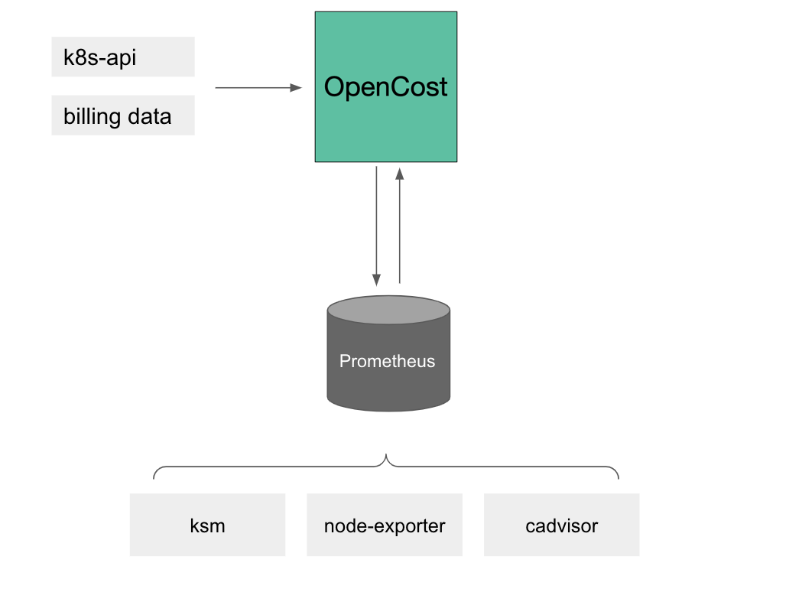
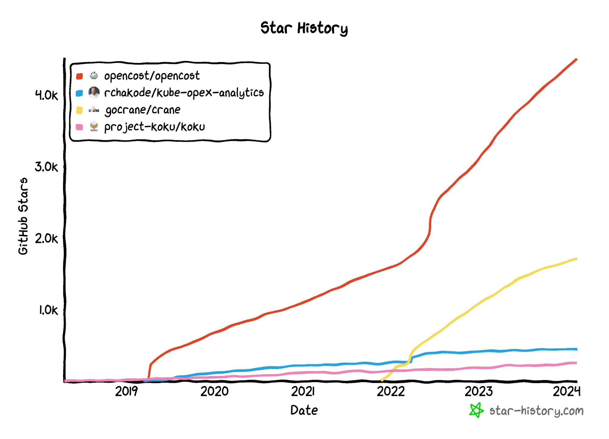

# OpenCost Due Diligence for Incubation 

**Authors:** Matt Ray, Webb Brown  
**TOC Sponsor:** Ricardo Rocha  
This document serves as the formal due diligence for the OpenCost project. The intention is to provide the required documentation and evidence for OpenCost to inform the TOC of the project’s readiness to be promoted to Incubation.   
**Resources and Links**

* TOC PR proposal: [https://github.com/cncf/toc/pull/1046](https://github.com/cncf/toc/pull/1046)  
* Presentation to TAG Observability:   
  * Comments here: [https://github.com/cncf/toc/pull/1046\#issuecomment-1684273663](https://github.com/cncf/toc/pull/1046#issuecomment-1684273663)  
  * Recording: [2023-09-19 CNCF TAG Observability Meeting](https://www.youtube.com/watch?v=c6ZW5448U5k&list=PLN9G8268O5ijM6z5UGA-Mv7Lt7ncdcBAs&index=4)  
* GitHub: [https://github.com/opencost/](https://github.com/opencost/)

**Document History**

* May 26, 2023: updated state of Governance and added plans for carbon cost support. Statistics were updated with the date added and the Star History image was added for comparing OpenCost vs. Crane and kube-opex-analytics. Dates were added for events and more links added where applicable.  
* Aug 8, 2023: updated timeline, releases, statistics, and fixed links.  
* Dec 8, 2023: updated feature sets, timeline, releases and statistics  
  * new Cloud Cost functionality    
  * Prometheus OpenCost Exporter merged into the [Prometheus community Helm charts](https://github.com/prometheus-community/helm-charts/tree/main/charts/prometheus-opencost-exporter) repository  
  * PR to add non-Kubecost maintainer  
* Feb 12, 2024: updated feature sets, timeline, release and statistics  
  * New non-Kubecost Maintainer  
  * New opencost-parquet-exporter repository  
  * Added Oracle Cloud Infrastructure and Docker support with 1.109.0

# TOC Assessment

OpenCost fills in a gap in a very relevant area in the cloud native ecosystem. The project has good traction on the end user side and integrates well with many of the popular infrastructures on which CNCF end users rely.

The code and structure of the project are of good quality and ensure a good path towards sustainability and extensibility. End users contacted expressed that the core functionality fits the use case and deployment and maintenance of the service follows the regular process for other cloud native projects.

While the popularity and quality of the project justify the incubation level of maturity, there were two issues raised more than once by end users:

* The project is very dependent on the Kubecost company. Internal processes were still relying on company resources (several fixed by now) but contributions also stay coupled to reviews by maintainers from Kubecost. Some end users expressed unhappiness during the interviews  
* The community relies on the hard work of very few, even more after the move of a key staff person from Kubecost. Investment on improving engagement is required to ensure end users, especially new ones, keep having good support longer term

The TOC recommends that the project engages with TAG-ContributorStrategy to improve its processes and become more open to contributions outside Kubecost. In a similar way, a review of the community support process would also help ensure end users continue easily adopting the project. These two items are essential before applying to graduation in the future.  

# Project Description

OpenCost is a vendor-neutral open source project for measuring and allocating cloud, Kubernetes, and infrastructure costs in real time. It was originally developed and open-sourced by [Kubecost](https://kubecost.com/). This project combines a [specification](https://www.opencost.io/docs/specification) as well as a Golang implementation of these detailed requirements. 

The goal of OpenCost is to be the default open source cloud cost monitoring platform. OpenCost currently fully supports Amazon Web Services, Microsoft Azure, Google Cloud Platform, Oracle Cloud Infrastructure, and on-premises with partial support for Alibaba Cloud and Scaleway. [There are tens of thousands of downloads of OpenCost daily](https://quay.io/repository/kubecost1/kubecost-cost-model) and potentially orders of magnitude greater when considering inclusion in AKS Cost Analysis, Grafana Cloud’s Kubernetes Monitoring, and Kubecost’s commercial offerings.

## Architecture Overview

OpenCost has a fairly straightforward architecture, it is currently a 2-container pod consisting of the OpenCost server and the web-based UI. The OpenCost [cost-model is written in Go](https://github.com/opencost/opencost) and provides cloud bill processing, cost allocation calculations and metrics, both reads and writes to Prometheus, and exposes an [API for external access](https://www.opencost.io/docs/integrations/api). The UI is a NodeJS application behind NGINX and handles routing to the OpenCost cost-model and Prometheus.  

OpenCost directly accesses cloud billing and exposes the contents for reporting via the API for Cloud Costs. OpenCost currently sources metrics from cAdvisor and Kube-State-Metrics for the underlying Kubernetes infrastructure. OpenCost writes this data to Prometheus, or a Prometheus-compatible backend, to use as the time-series data store for costs and health metrics.

## Features and Enhancements Since Joining the CNCF

Since joining the CNCF as a Sandbox Project in June of 2022, there have been monthly releases of OpenCost on GitHub with publicly-available containers hosted from [https://quay.io/repository/kubecost1/](https://quay.io/repository/kubecost1/kubecost-cost-model). Highlights from the features, bug fixes and performance enhancements include:

* Support for GCP spot instances was added in the 1.95 release.  
* Additional AWS regions were added in 1.96.  
* The 1.97 release included initial support for European cloud provider ScaleWay.  
* Kubernetes 1.25 support was included with 1.98.  
* The OpenCost UI was included in the default installation starting with version 1.99.  
* Version 1.99 also included initial support for China-based cloud provider Alibaba Cloud.  
* 1.0.0 release of the [OpenCost Helm chart](https://github.com/opencost/opencost-helm-chart/) for expanded installation options.  
* 1.103 brought [enhanced Azure billing integration](https://www.opencost.io/docs/azure-prices) and a daily [CSV export](https://www.opencost.io/docs/csv-export) of allocation data.  
* 1.104 Kubecost contributed non-k8s billing integration and cost monitoring to the project for future enhancements.  
* 1.106 added OpenShift support by removing the use of the root user within the UI containers  
* 1.107 added Kubernetes node overhead calculations through the API  
* 1.108 added general [Cloud Costs monitoring](https://www.opencost.io/blog/cloud-costs) beyond Kubernetes  
* The community sourced [opencost-parquet-exporter](https://github.com/opencost/opencost-parquet-exporter) was added as a new GitHub repository.  
* 1.109 brings support for Oracle Cloud Infrastructure and running without Kubernetes

## Documentation Improvements

Documentation currently exists in both the opencost and opencost-website repositories, and is presented on [http://opencost.io](http://opencost.io). Since joining the CNCF the website is now in the [OpenCost GitHub organization](https://github.com/opencost) and is aligned with the CNCF’s IP policy to ensure all documentation is under the Creative Commons Attribution 4.0 International License. There have been many updates to the documentation, highlights include:

* Installation, upgrade, uninstall and [Helm Chart instructions](https://www.opencost.io/docs/installation/helm) have all been greatly expanded.  
* A [swagger.json](https://raw.githubusercontent.com/opencost/opencost/develop/docs/swagger.json) OpenAPI document is now provided and [API documentation](https://www.opencost.io/docs/integrations/api) was added to the OpenCost website. This should make API-based integrations much simpler.  
* Each cloud provider has their own separate page with specific instructions for accessing cloud costs and any other cloud-specific features.  
  * [AWS](https://www.opencost.io/docs/configuration/aws)  
  * [Azure](https://www.opencost.io/docs/configuration/azure)  
  * [GCP](https://www.opencost.io/docs/configuration/gcp)  
  * [On-Premises](https://www.opencost.io/docs/configuration/on-prem)  
* A tour of the [OpenCost UI](https://www.opencost.io/docs/installation/ui)  
* [Setting up a Development Environment](https://www.opencost.io/docs/installation/development) with Tilt is now included.

## Future Plans

There have been extensive issue and pull request reviews to identify engineering efforts made previously by Kubecost on behalf of their commercial project versus those made on behalf of OpenCost. Issues and PRs were closed that were not applicable to the OpenCost project (the repository predated CNCF involvement as a Kubecost repository). Cleanups have been made to further separate OpenCost development and references to Kubecost features in the code, and this work is mostly completed. Kubecost Engineering is the primary driver of features and releases for OpenCost, [but external contributions are increasing and additional maintainers are being cultivated.](https://opencost.devstats.cncf.io/d/4/company-statistics-by-repository-group?orgId=1&var-period=d7&var-metric=activity&var-repogroup_name=OpenCost&var-companies=All&from=1654646924000&to=1701884623000)

With the recent addition of direct cloud billing access with the [Cloud Costs](https://www.opencost.io/blog/cloud-costs) monitoring support we are targeting general cloud usage beyond just Kubernetes. There will be a push towards all cloud costs by adding more reporting capabilities as well as supporting running in [non-Kubernetes environments](https://www.opencost.io/blog/k8sless-opencost) through Docker or CLI deployments.

The FinOps Foundation is participating in the development conversations as OpenCost looks to standardize on the [FinOps Open Cost and Usage Specification](https://www.finops.org/focus/) (FOCUS). Initial FOCUS patches have already been merged and [development continues](https://github.com/opencost/opencost/issues/1921). The intention is to add support for reading FOCUS billing as a first-class cloud provider and then provide a FOCUS tab in the UI so cloud bills from different providers can be normalized and compared.

Initial conversations with the [TAG Environmental Sustainability](https://tag-env-sustainability.cncf.io/) were had at KubeCon with the intention of adding the carbon footprint for Kubernetes workloads once a suitable billing API source is available. Microsoft Azure has some relevant metrics available in their billing API, we hope to start development soon. Similar discussions have been had with ThoughtWorks [Cloud Carbon Footprint](https://github.com/cloud-carbon-footprint/cloud-carbon-footprint) project and will [likely start development](https://github.com/opencost/opencost/issues/2121) in parallel, with the intention of releasing by KubeCon EU in Paris.

The External Asset Costs Working Group intended to bring support for services not directly managed by Kubernetes infrastructure. Examples of currently untracked costs that could be linked to Kubernetes infrastructure include network costs, monitoring, and external database services. Initial patches from Grafana Labs and Microsoft refactoring cloud providers to make it easier to introduce new billing and data sources. The initial External Asset Costs development was superseded by the Cloud Costs functionality, but will be revisited. These efforts should encourage external contributions from both vendors and users. 

There is a [ROADMAP.md](https://github.com/opencost/opencost/blob/develop/ROADMAP.md) and [issues are tagged with “enhancement”](https://github.com/opencost/opencost/issues?q=is%3Aissue+label%3Aenhancement+) to signify potential new features for consideration.

# OpenCost Development

Since becoming a CNCF Sandbox project last year OpenCost has continued to release monthly. According to the statistics provided by [OpenCost.DevStats.CNCF.io](https://opencost.devstats.cncf.io/d/18/overall-project-statistics-table?orgId=1&var-period_name=Last%20decade&var-repogroup_name=OpenCost) (as of February 12, 2024), 417 individuals have contributed to OpenCost with 115 code committers. Issues and PRs are regularly reviewed, responded, or processed with responses usually under 24 hours. 

## Project Maintenance and Governance

The initial OpenCost [governance model](https://github.com/opencost/opencost/blob/develop/GOVERNANCE.md) has been released, aligning with the [CNCF best practices](https://www.cncf.io/blog/2019/08/30/cncf-technical-principles-and-open-governance-success/). There are 3 levels of membership:

* Contributors to the project may be invited to join the OpenCost community as Members, which adds them to the GitHub OpenCost organization.   
* [Members](https://github.com/orgs/opencost/teams/opencost-community) with sustained contributions may be invited to become Committers and review and manage issues for the project.   
* [Committers](https://github.com/orgs/opencost/teams/opencost-committers) with sustained involvement with the project may be invited to become Maintainers, granting them further repository privileges and decision-making authority over the direction of the project.

Currently Kubecost’s technical team contributes most of the code submissions to OpenCost based on the inputs and feedback from Kubecost Product Management and issues and PRs raised from the OpenCost community. 

* Incoming issues are triaged by the OpenCost Community Manager (a Kubecost employee), Kubecost Engineering, and OpenCost community members.   
* Community-sourced features have increased, with major contributions from Grafana Labs, Microsoft, and Zendesk.   
* As the OpenCost community continues to grow, we will continue to evolve product management and roadmap to a more community-focused approach with RFCs for major changes.  
* The [first non-Kubecost Maintainer](https://github.com/opencost/opencost/pull/2372) has been added from Microsoft.

The [OpenCost spec](https://github.com/opencost/opencost/tree/develop/spec) was co-authored by [founding members from over ten companies](https://www.cncf.io/blog/2022/12/06/opencost-a-new-cncf-sandbox-project-for-real-time-kubernetes-cost-monitoring/), including Adobe, AWS, Google, New Relic and Red Hat. The External Asset Costs working group is defining new specifications and reference code with participants across half a dozen companies so far, including Grafana Labs, Microsoft, and the FinOps Foundation. Fortnightly meetings for discussion are on the [shared community calendar](https://bit.ly/opencost-calendar) with shared notes (with recordings available). This regular cadence elevates feedback quickly and has worked well so far.

## Code Quality and Testing

All incoming Pull Requests are tested with GitHub Actions to execute the unit tests defined in the test and pkg/\* directories against amd64 and arm64 platforms with [Docker](https://github.com/opencost/opencost/blob/develop/Dockerfile). Code formatting is enforced with go fmt and go vet is used for checking code quality. Kubecost provides integration testing and performance testing as part of their release process. OpenCost currently has a “A+” score with [Go Report Card](https://goreportcard.com/report/github.com/opencost/opencost). 

The Helm chart is tested with the [GitHub Action](https://github.com/opencost/opencost-helm-chart/blob/main/.github/workflows/helm-test.yml) helm/chart-testing-action which provides linting with ct lint and integration testing with ct install against a Kubernetes in Docker cluster.

The OpenCost parquet exporter test with pylint.

The OpenCost website creates temporary sites on approved PRs with Vercel to evaluate the changes.

All merged code requires the approval of at least 1 reviewer.

## DevStats

OpenCost [DevStats](https://opencost.devstats.cncf.io/) provides statistics on GitHub activity. Average statistics from the last 90 days (February 12, 2024):

* [Contributions per Day: \> 17 from \> 23 contributors per week](https://opencost.devstats.cncf.io/d/74/contributions-chart?orgId=1&from=now-90d&to=now&var-period=d7&var-metric=contributions&var-repogroup_name=OpenCost&var-country_name=All&var-company_name=All&var-company=all)  
* [Median Comments per PR: 2](https://opencost.devstats.cncf.io/d/17/pr-comments?orgId=1&from=now-90d&to=now)  
* [Median PR Time to Engagement: \< 7 hours](https://opencost.devstats.cncf.io/d/10/pr-time-to-engagement?orgId=1&var-period=d7&var-repogroup_name=OpenCost&from=now-90d&to=now)  
* [Median PR Open to Merge: \< 7 hours](https://opencost.devstats.cncf.io/d/16/opened-to-merged?orgId=1&var-period=d7&var-repogroup_name=OpenCost&from=now-90d&to=now)  
* [Issues Opened Weekly: \> 5](https://opencost.devstats.cncf.io/d/12/issues-opened-closed-by-repository-group?orgId=1&from=now-90d&to=now&var-period=w&var-repogroup_name=OpenCost)  
* [Issues Closed Weekly: \> 5](https://opencost.devstats.cncf.io/d/12/issues-opened-closed-by-repository-group?orgId=1&from=now-90d&to=now&var-period=w&var-repogroup_name=OpenCost)  
* [PRs Opened Weekly: \> 15](https://opencost.devstats.cncf.io/d/12/issues-opened-closed-by-repository-group?orgId=1&from=now-90d&to=now&var-period=w&var-repogroup_name=OpenCost)  
* [PRs Closed Weekly: \> 15](https://opencost.devstats.cncf.io/d/12/issues-opened-closed-by-repository-group?orgId=1&from=now-90d&to=now&var-period=w&var-repogroup_name=OpenCost)  
* [69 of the top 100 contributors are not current/former Kubecost employees](https://opencost.devstats.cncf.io/d/66/developer-activity-counts-by-companies?orgId=1&var-period_name=Last%20decade&var-metric=contributions&var-repogroup_name=OpenCost&var-country_name=All&var-companies=All)

## CLOMonitor Status

[CLOMonitor](https://clomonitor.io/projects/cncf/opencost) is a tool that checks open source projects repositories to verify they meet certain project health best practices. OpenCost currently has the following scores (out of 100:

* Documentation: 97 \- OpenCost requires a Changelog and to publish to the Summary Table to increase this score.  
* License: 75 \- OpenCost does not currently have license scanning for dependencies.  
* Best Practices: 68 \- OpenCost is not listed on Artifact Hub and does not have an OpenSSF Scorecard badge (not sure .  
* Security: 59 \- OpenCost does not currently provide an SBOM (this has been remedied), does not sign releases, and needs to further secure the CI/CD workflows.  
* Legal: 100 \- OpenCost is in full Linux Foundation trademark compliance.

# Alignment with Cloud Native Computing Foundation

OpenCost is currently used in conjunction with the following CNCF projects:

* **Helm**: OpenCost has an [opencost-helm-chart](https://github.com/opencost/opencost-helm-chart) repository that provides a Helm chart for deploying and upgrading OpenCost installations.  
* **Kubernetes**: OpenCost is installed on Kubernetes and relies on Kubernetes’ APIs for aligning Kubernetes resources with allocated cloud costs.  
* **Prometheus**: In default installations OpenCost stores metrics in Prometheus’ time series database and uses the Prometheus node-exporter to supplement monitoring data. There is a [prometheus-opencost-exporter](https://github.com/prometheus-community/helm-charts/tree/main/charts/prometheus-opencost-exporter) in the Prometheus Community Helm Charts repository.  
* **Cortex**: Storage option used as an alternative to Prometheus, supported by the OpenCost Helm chart.  
* **Thanos**: Storage option used as an alternative to Prometheus, supported by the OpenCost Helm chart and used by Kubecost with their commercial implementation.  
* **Backstage**: The [OpenCost Backstage plugin](https://github.com/backstage/backstage/tree/master/plugins/opencost) is included in the primary Backstage repository.

## Other Open Source Projects

* **Go**: The OpenCost cost-model is written in Go.  
* **Grafana:** OpenCost provides metrics that are frequently displayed by Grafana dashboards. Example Grafana dashboards are included with the OpenCost Helm chart. Grafana Labs deploys OpenCost internally with their Kubernetes clusters as well.  
* **Mimir**: Storage option used as an alternative to Prometheus, supported by Grafana Labs.  
* **React**: The OpenCost UI and the OpenCost.io website are written with the React Javascript framework.  
* **Victoria Metrics**: Storage option used as an alternative to Prometheus, their engineering has contributed patches to OpenCost.

# Alternatives

Commercial alternatives to OpenCost include Kubernetes-specific products from [CAST AI](https://cast.ai/), [Fairwinds](https://www.fairwinds.com/). Kubernetes cloud pricing support is included in offerings from [CloudZero](https://www.cloudzero.com/), [Finout](https://www.finout.io/), [Harness](https://www.harness.io/), and [VMware Tanzu CloudHealth](https://cloudhealth.vmware.com/) (formerly CloudHealth). Public cloud providers offer some limited visibility into Kubernetes, but it is not directly tied to their pricing.

Open source alternatives include the commercially-backed [Crane](https://github.com/gocrane/crane), Red Hat’s [Project Koku](https://project-koku.github.io/), and [kube-opex-analytics](https://github.com/rchakode/kube-opex-analytics).  
OpenCost is currently included in commercial offerings from Kubecost, [Microsoft](https://www.opencost.io/blog/aks-cost-analysis), [Grafana Labs](https://www.opencost.io/blog/grafana-cloud), [CloudAdmin](https://cloudadmin.io/), and [Port](https://www.getport.io/).

# OpenCost Community

## Growing Community

Ever since joining the CNCF Sandbox, we have seen substantial growth in the community since the project was announced June 2, 2022\. Project stats have grown notably in the past year in CNCF: 

| Stats | Current (February 13, 2024\) | Sandbox |
| :---: | :---: | :---: |
| [Stargazers](https://opencost.devstats.cncf.io/d/3/stars-and-forks-by-repository?orgId=1) | 4505 | 2000 |
| Commits | 4333 | 2739 |
| [Forks](https://opencost.devstats.cncf.io/d/3/stars-and-forks-by-repository?orgId=1) | 494 | 192 |
| [Contributors](https://opencost.devstats.cncf.io/d/18/overall-project-statistics-table?orgId=1&var-period_name=Last%20decade&var-repogroup_name=OpenCost) | 417 | 40 |
| Slack members | 928 | \- |
| LinkedIn followers | 563 | 70 |

## Events

We actively host or take part in various community programs and events, tracked on the [OpenCost Community Calendar](https://bit.ly/opencost-calendar): 

* There is a fortnightly OpenCost [working group meeting](https://docs.google.com/document/d/1JFB_-sjF8F9UWet1c-dWixdMZY4hri23UlQG5FX5xfY/edit#), where community members and external stakeholders are invited to discuss the project and their experiences with OpenCost to shape future development.  
* June 22-25, 2022: Presentations were given at [FinOps X](https://www.youtube.com/watch?v=L_tvecd8ssY) and the [Open Source Summit North America](https://www.youtube.com/watch?v=CPwLWXuZlmg) in 2022\.  
* October 13, 2022: Virtual meetup at the [Sydney FinOps Meetup](https://www.meetup.com/cloud-finops-sydney/).  
* February 2, 2023: CNCF On-Demand Webinar: [Cloud Cost Monitoring with OpenCost and Kubernetes Optimization Strategies](https://community.cncf.io/events/details/cncf-cncf-online-programs-presents-cncf-on-demand-webinar-cloud-cost-monitoring-with-opencost-and-kubernetes-optimization-strategies/)  
* March 9-12, 2023: Southern California Linux Expo \- booth and [talk](https://youtu.be/CiqIqcM1d6o) with [slides](https://www.slideshare.net/mattray/scale-20x-kubernetes-cloud-cost-monitoring-with-opencost-optimization-strategies)  
* April 18-21, 2023: KubeCon EU \- full-time OpenCost kiosk in the Project Pavilion  
* November 6-9, 2023: KubeCon NA \- project working session, full-time OpenCost kiosk in the Project Pavilion.  
* December 14, 2023: CNCF On-Demand Webinar: [OpenCost Kubernetes cost monitoring deep dive](https://community.cncf.io/events/details/cncf-cncf-online-programs-presents-cncf-on-demand-webinar-opencost-kubernetes-cost-monitoring-deep-dive/)  
* Numerous podcasts and meetups discussing the project.

These events and webinars have been great chances for newcomers and community members to get to know more about the project, and they certainly helped attract contributions and brought visibility and diversity to the project.

## Documentation and Content

[OpenCost documentation](https://www.opencost.io/docs/) is available from [https://www.opencost.io/docs/](https://www.opencost.io/docs/) and the source for the documentation is at [https://github.com/opencost/opencost-website/tree/main/docs](https://github.com/opencost/opencost-website/tree/main/docs). 

[API documentation](https://www.opencost.io/docs/integrations/api) is on the website and as an OpenAPI document on GitHub: [https://github.com/opencost/opencost/blob/develop/docs/swagger.json](https://github.com/opencost/opencost/blob/develop/docs/swagger.json)

The OpenCost Helm chart is documented on GitHub: [https://github.com/opencost/opencost-helm-chart/blob/main/charts/opencost/README.md](https://github.com/opencost/opencost-helm-chart/blob/main/charts/opencost/README.md)

## Community Support

OpenCost strives to become a supportive and welcoming community. 

* Slack: [CNCF](http://slack.cncf.io) / \#opencost  
* OpenCost Community Calendar: [https://bit.ly/opencost-calendar](https://bit.ly/opencost-calendar)  
* Fortnightly OpenCost Working Group Community Meeting: [https://bit.ly/opencost-meeting](https://bit.ly/opencost-meeting)  
* Documentation: [https://opencost.io/docs](https://opencost.io/docs)  
* Mastodon: [https://hachyderm.io/@opencost](https://hachyderm.io/@opencost)  
* Twitter: [https://twitter.com/open\_cost](https://twitter.com/open_cost)

# Incubation stage requirements

Document that the project fulfills the requirements as documented in the [CNCF Incubation criteria](https://github.com/cncf/toc/blob/main/process/project_proposals.md#incubation-process).

## Adoption and Production Usage

An ADOPTERS.MD has been added to the repository for organizations to self-document their usage of OpenCost.  
Here are some use case highlights from our end-users:

1. Kubecost was the initial provider of the OpenCost code base and continues to invest substantial resources in its success. OpenCost is the engine that powers thousands of Kubecost installations and we are committed to its success as a healthy open source project.  
2. Grafana Labs announced our OpenCost participation on our blog [How Grafana Labs uses and contributes to OpenCost](https://grafana.com/blog/2023/02/02/how-grafana-labs-uses-and-contributes-to-opencost-the-open-source-project-for-real-time-cost-monitoring-in-kubernetes/). Grafana Labs has contributed significant enhancements to OpenCost and pledges continued support to improved observability, ease of use, and performance. Moreover, Grafana Labs has been actively promoting OpenCost to the Kubernetes community and encouraging more contributions from other developers to further improve the tool by engaging with users directly in the CNCF slack channel and on GitHub. We look forward to the continued success of the OpenCost project.  
3. National Information Solutions Cooperative (NISC) is an IT cooperative that delivers advanced solutions, services and support to rural utilities and independent broadband companies across the U.S., American Samoa, Palau and Canada. OpenCost has provided much needed insight into cost allocation, helping to prioritize cost savings efforts which ultimately are passed back to the hands of utility and broadband customers of the member owners we serve.  
4. CloudAdmin provides cloud cost savings on AWS, Azure, and GCP. CloudAdmin uses OpenCost as their primary Kubernetes cost optimization platform, and is running in production across multiple Fortune 500 companies.  
5. Microsoft is committed to meeting customer needs through adoption of and contribution to vendor-neutral open source solutions wherever possible. With an increasing number of AKS customers seeking to understand and optimize the cost of their multi-tenant environments, it was a natural fit for us to invest in the OpenCost project, adding key capabilities requested by our customers, including refined resource pricing information and CSV export of cost data. We look forward to further collaborations with the broader OpenCost community.  
6. Kubecost is built on OpenCost, which was recently accepted as a Cloud Native Computing Foundation (CNCF) Sandbox project, and is actively supported by AWS.

## Commits and Contributions

According to the statistics provided by [OpenCost.DevStats.CNCF.io](https://opencost.devstats.cncf.io/d/18/overall-project-statistics-table?orgId=1&var-period_name=Last%20decade&var-repogroup_name=OpenCost) and GitHub (February 13, 2024):

* 410+ individuals have contributed from [over 50 companies](https://opencost.devstats.cncf.io/d/5/companies-table?orgId=1)  
* There are 490+ forks  
* 115 code committers  
* 330+ commenters on Issues/PRs  
* Contributions have come from over 30 countries  
* And there are over 1890 stars on the repositories

The OpenCost project has documented the governance policy for designating Committers and Maintainers and invitations are being extended to start formally expanding the community. OpenCost currently has [8 Maintainers](https://github.com/orgs/opencost/teams/opencost-maintainers) and [21 Committers](https://github.com/orgs/opencost/teams/opencost-committers) from 7 organizations with expanded permissions in GitHub. The OpenCost Helm chart has [3 Maintainers](https://github.com/opencost/opencost-helm-chart) and 48 contributors so far.

Current development decisions are primarily discussed in GitHub Issues and in the respective working group meetings. To ensure transparent decision-making, OpenCost will adopt a [Request for Comments (RFC) process](https://github.com/chaos-mesh/rfcs/) similar to other projects for any substantial changes to the project. There is an [open issue tracking discussion](https://github.com/opencost/opencost/issues/1954) for updating the [GOVERNANCE.md](https://github.com/opencost/opencost/blob/develop/GOVERNANCE.md#proposal-process) to include RFCs.

## Clear Versioning Scheme

OpenCost repositories follow the [Semantic Versioning 2.0.0 convention](https://semver.org/). So far we have 15 OpenCost releases, with the initial OpenCost 1.94 released in June 2022, and the current release is 1.109 from February 2024\. The 1.x series are considered stable and have been in production for years.  
The release cadence is:

* There have been no additional major releases since OpenCost was added to the CNCF.  
* Minor versions are released every month.  
* Patch versions are released as necessary.

The releases are announced using [GitHub’s releases](https://github.com/opencost/opencost/releases), followed by Slack (CNCF/\#opencost), Mastodon, Twitter, and discussion in the fortnightly Community Meetings.

## Documented Security Processes

The security process for OpenCost is documented in the [SECURITY.md](https://github.com/opencost/opencost/blob/develop/SECURITY.md). Here is an abbreviated summary:

* All code is version-controlled with known committers.  
* Dependencies are checked by [Dependabot](https://docs.github.com/en/code-security/supply-chain-security/understanding-your-software-supply-chain/about-supply-chain-security#what-is-dependabot).  
* The current and previous releases are supported for security fixes.  
* Vulnerability reporting is handled through GitHub-provided [private vulnerability reporting](https://docs.github.com/en/code-security/security-advisories/guidance-on-reporting-and-writing/privately-reporting-a-security-vulnerability).  
* Vulnerabilities will be disclosed once confirmed and a public fix released.

# Additional project information

* **License:** Apache 2.0  
* **Source control repositories:** [https://github.com/opencost/](https://github.com/opencost/opencost)  
* **Contributing guide:** [https://github.com/opencost/opencost/blob/master/CONTRIBUTING.md](https://github.com/opencost/opencost/blob/master/CONTRIBUTING.md)  
* **Website:** [https://opencost.io](https://opencost.io)  
* **Documentation:** [https://www.opencost.io/docs/](https://www.opencost.io/docs/)  
* **Blog:** [https://www.opencost.io/blog](https://www.opencost.io/blog)  
* **Governance:** [https://github.com/opencost/opencost/blob/develop/GOVERNANCE.md](https://github.com/opencost/opencost/blob/develop/GOVERNANCE.md)  
* **List of Maintainers & Committers:**  
  * [https://github.com/opencost/opencost/blob/develop/MAINTAINERS.md](https://github.com/opencost/opencost/blob/develop/MAINTAINERS.md)  
  * [https://github.com/opencost/opencost-helm-chart/\#maintainers](https://github.com/opencost/opencost-helm-chart/#maintainers)  
* **Code of Conduct:** [https://github.com/opencost/opencost/blob/master/CODE\_OF\_CONDUCT.md](https://github.com/opencost/opencost/blob/master/CODE_OF_CONDUCT.md)  
* **CI/CD and Testing Methodology**:   
  * OpenCost uses GitHub Action for the following:   
  * Code check (go fmt/go vet/go lint/...)  
  * Unit test  
  * Integration Test  
* **Publishing Releases**  
  * OpenCost is branched (ie “1.102”), release candidates are tagged (ie. “1.102.rc1), then releases are tagged, pushed to container hosting (Quay.io), and promoted in GitHub  
  * OpenCost Helm Chart uses GitHub Actions on merged PRs  
  * OpenCost Website uses Vercel on merged PRs  
* **Issue Trackers:**   
  * [https://github.com/opencost/opencost/issues](https://github.com/opencost/opencost/issues)  
  * [https://github.com/opencost/opencost-helm-chart/issues](https://github.com/opencost/opencost-helm-chart/issues)  
  * [https://github.com/opencost/opencost-parquet-exporter/issues](https://github.com/opencost/opencost-parquet-exporter/issues)  
  * [https://github.com/opencost/opencost-website/issues](https://github.com/opencost/opencost-website/issues)  
  * We actively use labels to distinguish between types of issues. Issues such as bugs or enhancement requests are also correspondingly labeled so that they are prioritized as part of the minor version releases or patch releases.  
* **Project channels**  
  * Slack: [CNCF](http://slack.cncf.io) / \#opencost  
  * LinkedIn: [https://www.linkedin.com/showcase/opencost/](https://www.linkedin.com/showcase/opencost/)  
  * OpenCost Community Calendar: [https://bit.ly/opencost-calendar](https://bit.ly/opencost-calendar)  
  * Fortnightly OpenCost Working Group Community Meeting notes: [https://bit.ly/opencost-meeting](https://bit.ly/opencost-meeting)  
  * Mastodon: [https://hachyderm.io/@opencost](https://hachyderm.io/@opencost)  
  * Twitter: [https://twitter.com/open\_cost](https://twitter.com/open_cost)

# Appendix

## Project Timeline

* June 2, 2022: [OpenCost accepted as a CNCF Sandbox Project](https://www.opencost.io/blog/introducing-opencost)  
* June 14, 2022: First official OpenCost release (1.94). Previous open source releases were called “kubecost-cost-model”.  
* June 20, 2022: FinOps X presentation [Introducing OpenCost](https://www.youtube.com/watch?v=L_tvecd8ssY) by Webb Brown (Kubecost) & Chris Aniszczyk (CNCF).  
* June 24, 2022: Open Source Summit North America presentation [OpenCost Introduction](https://docs.google.com/presentation/d/1TDMu6V-J3Mu0hljthnfEz672LhoQ6bKGAsJm2hV5Amg/edit#slide=id.g11eb13674e9_0_0) by Webb Brown  
* July 15, 2022: 1.95 release supporting GCP spot instances  
* August 12, 2022: 1.96 release providing additional AWS regions and memory usage reductions.  
* September 20, 2022: 1.97 release adding initial ScaleWay support  
* November 4, 2022: 1.98 release supporting Kubernetes 1.25 and performance enhancements.  
* November 23, 2022: [OpenCost website](http://github.com/opencost/opencost-website/) moved to OpenCost GitHub organization  
* December 13, 2022: [OpenCost Helm Chart](http://github.com/opencost/opencost-helm-chart/) repository created.   
* December 14, 2022: 1.99 release which is the first [including OpenCost UI in the default installation](https://www.opencost.io/blog/opencost-ui) and included initial Alibaba Cloud support.  
* February 2, 2023: CNCF On-Demand Webinar: [Cloud Cost Monitoring with OpenCost and Kubernetes Optimization Strategies](https://community.cncf.io/events/details/cncf-cncf-online-programs-presents-cncf-on-demand-webinar-cloud-cost-monitoring-with-opencost-and-kubernetes-optimization-strategies/)  
* February 8, 2023: 1.100 release including performance enhancements with code contributions from [Grafana Labs](https://www.opencost.io/blog/grafana-labs).  
* February 16, 2023: 1.0.0 release of the Helm chart   
* February 27, 2023: OpenCost announced as a [FinOps Certified Solution](https://www.opencost.io/blog/finops-certified-solution).  
* February 28, 2023: Kick-off for the [External Asset Costs Working Group](https://docs.google.com/document/d/1-d-Vvy1VGHW0sXKiTjTplIUEnrElIlnfMU8sUpEehlA/edit), which will bring support for services not directly managed by the Kubernetes infrastructure.  
* March 9-12, 2023: OpenCost booth and [presentation](https://www.slideshare.net/mattray/scale-20x-kubernetes-cloud-cost-monitoring-with-opencost-optimization-strategies) at the Southern California Linux Expo.  
* April 18, 2023: [Microsoft announces they have joined the OpenCost community](http://aka.ms/aks/OpenCost-AKS)y with code and feature contributions and a new [Azure Billing Rate Card API](https://www.opencost.io/docs/azure-prices) supporting OpenCost.  
* April 18-21, 2023: OpenCost has a full-time staffed kiosk at KubeCon EU in the Project Pavilion.  
* June 27, 2023: [Grafana Cloud announces their inclusion of OpenCost](https://www.opencost.io/blog/grafana-cloud) in their commercially supported Kubernetes Monitoring product.  
* June 27, 2023: OpenCost announces participation in the [FinOps Open Cost and Usage Specification](https://www.opencost.io/blog/focus) (FOCUS) while attending the FinOps X conference.  
* August 16, 2023: [OpenCost plugin for Backstage](https://www.opencost.io/blog/backstage) merged into the Backstage project.  
* October 31, 2023: [Cloud Cost monitoring](https://www.opencost.io/blog/cloud-costs) announced for inclusion in the 1.108 release.  
* November 6-9, 2023: OpenCost has a full-time staffed kiosk at KubeCon NA in the project pavilion. There is an OpenCost Working session and 2 OpenCost-related talks on the schedule.  
  * [Node Size Matters \- Running K8s as Cheaply as Possible](https://www.youtube.com/watch?v=6vNI_O6sdvY&list=PLj6h78yzYM2MYc0X1465RzF_7Cqf7bnqL&index=141)  
  * [Where's Your Money Going? The Beginners Guide to Measuring Kubernetes Costs](https://www.youtube.com/watch?v=8eiLXtL3oLk&list=PLj6h78yzYM2MYc0X1465RzF_7Cqf7bnqL&index=240)  
* November 16, 2023: [Microsoft announces](https://aka.ms/aks/cost-analysis) they are including OpenCost as part of their Azure Kubernetes Service Cost Analysis tool.  
* December 7, 2023: The [Prometheus OpenCost Exporter](https://github.com/prometheus-community/helm-charts/tree/main/charts/prometheus-opencost-exporter) is merged into the Prometheus Community Helm Chart repository  
* December 8, 2023: [Artur Khantimirov from Microsoft](https://github.com/opencost/opencost/pull/2372) becomes the first OpenCost Maintainer not from Kubecost  
* December 14, 2023: CNCF On-Demand Webinar: [OpenCost Kubernetes cost monitoring deep dive](https://community.cncf.io/events/details/cncf-cncf-online-programs-presents-cncf-on-demand-webinar-opencost-kubernetes-cost-monitoring-deep-dive/)  
* January 19, 2024: initial commit to community-contributed [opencost-parquet-exporter](https://github.com/opencost/opencost-parquet-exporter)
