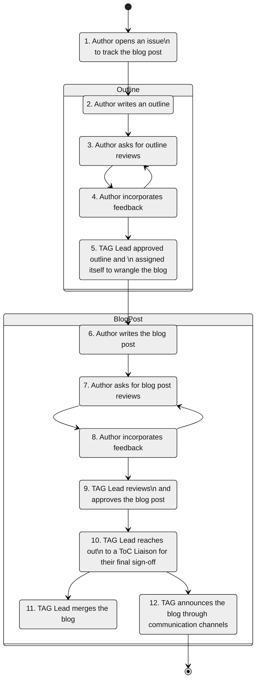

# Blog Post process within the `⚠️ <TAG NAME>`

<!--- **How to complete this template.**
1. Update the placeholders and links marked with a ⚠️
2. Review the process and extend / simplify it
   1. The process is divided into two phases: The first phase is about writing and discussing the blog post abstract, and the second is about reviewing and publishing the blog post. The first phase can be omitted if the TAG wants an even smaller process for blog posts. Comments highlight the sections that needs to be updated.
--->

This document describes the process writing blogs for the CNCF `⚠️ <TAG NAME>` blog.
The blog is found under [`⚠️ tag-xxx`.cncf.io/blog](https://cncf.io/).
The website is part of the TAG repository, blog post are located in this folder [`⚠️ website/content/blog`](https://github.com/cncf/tag-xxx/tree/main/website/content/blog).

- [Blog Post process within the `⚠️ <TAG NAME>`](#blog-post-process-within-the-️-tag-name)
  - [Process](#process)
    - [Writing an outline](#writing-an-outline)
    - [Asking for reviews](#asking-for-reviews)
    - [Incorporating Reviews](#incorporating-reviews)
  - [Sponsorship](#sponsorship)
  - [Review Guidelines](#review-guidelines)

## Process

The diagram below gives an overview of the blog post process.



1. Open up an [⚠️ issue](https://github.com/cncf/tag-xxx/issues/new/choose) with the template `blog`. This issue template guides you through the process.
<!-- ⚠️ OPTIONAL: Steps 2 - 5; decide if the TAG likes to review an abstract first ⚠️ -->
2. Write an outline for your blog. Follow this section [writing an outline](#writing-an-outline) for more insights. 
3. The author asks for blog post outline reviews publicly. Follow this section [asking for reviews](#asking-for-reviews) for more insights.
4. The author includes feedback. Follow this section [incorporating reviews](#incorporating-reviews) for more insights.
5. As soon as the outline has been discussed feedback has been included the assigned TAG Lead will do the sign off.
6. The author writes the blog post following the previously established outline. The blog post can be written directly in a Markdown file, which is pushed directly to the website via a PR. The review is then performed in the PR. Alternatively, blog posts can be written in a Google Docs file that is publicly editable. We are flexible on this.
7. The author asks for blog post reviews publicly. Follow this section [asking for reviews](#asking-for-reviews) for more insights.
8. The author includes feedback. Follow this section [incorporating reviews](#incorporating-reviews) for more insights.
9. As soon as the blog post has been discussed feedback has been included the assigned TAG Lead will do the sign off.
10. TAG Lead reaches out to one of the ToC Liaisons for their final sign-off
11. TAG Lead merges the blog post. The blog post appears on the website [`⚠️ tag-xxx`.cncf.io/blog](https://cncf.io/).
12. TAG Lead or a communications representative of the TAG announces the blog post.

### Writing an outline

Before writing the blog post, it is important that you discuss your blog post idea with the reviewers and the TAG. To express your ideas follow the next points.

* Firstly, start with an **"Abstract"** section that provides a concise overview of the blog post's main topic and key points. This helps readers grasp the essence of the content at a glance.
* Next, include a **"Scope"** section that outlines the boundaries and limitations of the blog post. Clearly define what aspects will be covered and what won't, ensuring a focused and cohesive narrative.
* The **"Goals and Non Goals"** section should articulate the specific objectives the blog post aims to achieve and what it does not intend to address. This clarifies the purpose and helps manage reader expectations. 
* Finally, the **"Expected Audience"** section should outline the target readership, specifying their knowledge level, background, or any other relevant characteristics. Understanding the intended audience ensures the content is tailored appropriately and effectively resonates with the readers.

By including these sections, you have more guidance for a well-structured and targeted post that clearly adds value and engagement to the blog writing. The outline also gives reviewers the opportunity to give advice before much work has been done.

### Asking for reviews

When seeking blog post reviews, it is essential to adopt a public and transparent approach to encourage participation and diverse perspectives.
Begin by posting a Slack message in `⚠️ #tag-xxx`, asking for reviews and providing a link to the blog post.
Post under the GitHub issue once you've taken someone's feedback so they can take another look at it.
Additionally, mention the blog post during the TAG meetings to raise awareness.
In the event of insufficient reviews, notify the assigned TAG Lead, seeking their support in facilitating the review process.

### Incorporating Reviews

It is of utmost importance that each review of the blog post be treated with care and thoughtfulness. 
If there are open reviews that are not addressed, then the blog will not be published.
Reviews are meant to provide valuable insight and suggestions for improving the quality of your content. By taking this perspective, you can view reviews as constructive opportunities for growth rather than personal criticism. By keeping an open mind and taking feedback into account, you can refine your blog post, amplify its impact, and provide a more engaging experience for your readers. Emphasizing the collaborative nature of reviews fosters a positive environment where continuous improvement is the driving force behind your writing efforts.

If the review does not meet our [review guidelines](#reviewguidelines), please make this transparent in GitHub and give the reviewer the opportunity to self-improve in the way they conduct reviews. Focus on resolving a conflict before they occur.
If a conflict cannot be resolved, ask your [Blog Post Sponsor](#sponsorship) for assistance.

## Sponsorship

Co-Chairs of the TAG are responsible for the content that the TAG produces, as such a Co-chair or Technical lead should be the primary "sponsor" of a blog post that allows a contributor or member of the TAG to lead the content creation, timelines, communication, and tracking approvals.
Once the "sponsor" is satisfied with the content, they notify the TOC liaison to review and provide a final sign-off.

## Review Guidelines

When reviewing blogs, kindness, support, and a sincere desire to help the author should come first.
The main goal should be to provide constructive feedback and help the author improve the quality of their content.
Throughout the interaction, it is essential to strictly adhere to the [⚠️ code of conduct](../CODE-OF-CONDUCT.md), fostering a culture of respect, inclusivity, and professionalism.
By adhering to these fundamental principles, we can cultivate a positive and collaborative environment that encourages authors to thrive and flourish in their writing endeavors.

1. **Read the post thoroughly**: Start by thoroughly reading the entire blog post. Pay attention to technical details, code snippets, and explanations provided.
2. **Consider the target audience**: Identify the intended audience for the blog post. Is it written for beginner developers, experienced programmers, or a specific niche? Evaluate whether the content is appropriate and understandable for the target readership.
3. **Assess the title and introduction**: Review the title and introduction to determine if they effectively capture the reader's attention and provide a clear overview of what the post is about. A concise and informative title, along with a compelling introduction, can engage readers and set expectations.
4. **Check the structure and flow**: Evaluate the overall structure and flow of the blog post. Look for a logical organization, clear headings, and subheadings. Ensure that the content follows a coherent progression and is easy to follow.
5. **Analyze the technical accuracy**: Examine the technical accuracy of the content. Check if the information provided is correct, up-to-date, and follows best practices. Evaluate whether the author demonstrates a deep understanding of the topic and provides accurate explanations and examples.
6. **Evaluate the clarity and depth**: Assess the clarity of the explanations and instructions provided in the blog post. Determine if the author effectively communicates complex concepts and techniques. Look for in-depth explanations and examples that help readers understand the subject matter.
7. **Assess code examples and snippets**: Evaluate the code examples and snippets included in the blog post. Check for correctness, readability, and adherence to coding standards. Consider if the code is well-commented and includes any necessary error handling or exception handling.
8. **Look for visual aids**: Assess if the blog post incorporates relevant visual aids such as diagrams, charts, or screenshots. Evaluate whether these visuals enhance the content and make it easier to understand or follow along with.
9. **Check for readability and formatting**: Consider the readability and formatting of the blog post. Look for clear and concise sentences, proper use of technical terms, and consistent formatting of code snippets. Ensure that the language used is accessible to the target audience and avoids unnecessary complexity or ambiguity.
10. **Provide constructive feedback**: Offer specific and constructive feedback to help the author improve the blog post. Identify areas that need clarification, provide suggestions for additional code examples or explanations, and highlight any potential errors or omissions. Be supportive in your critique and focus on helping the author enhance the technical quality and readability of their content.

Follow this [guide](https://docs.github.com/en/pull-requests/collaborating-with-pull-requests/reviewing-changes-in-pull-requests/reviewing-proposed-changes-in-a-pull-request) for an introduction how to review Pull Requests (PRs) on GitHub.
Suggesting edits to the document can be done nicely by using a special codeblock `suggestion`

````md
<!-- Proposed text -->
Hello Word!

<!-- Your review -->
```suggestion
Hello World!
```
````

If the review is done on google docs make sure to use the [suggestion](https://support.google.com/docs/answer/6033474?hl=en&co=GENIE.Platform%3DDesktop&oco=0) feature. If that's not possible, make sure you make it clear how the author can clearly incorporate your review and not have to guess what exactly you mean by your proposed change.