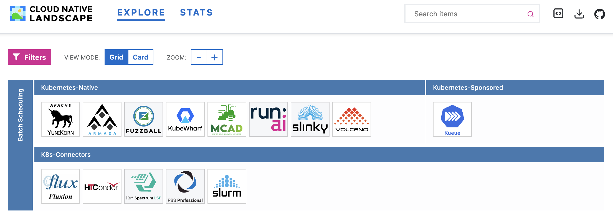

# CNCF Batch Subproject

<!-- THIS FILE IS AUTO-GENERATED FROM /tags.yaml -->

## Mission Statement
The cloud-native batch scheduling ecosystem is fragmented — different projects tackle job scheduling, queueing, and resource management in incompatible ways. The Batch subproject brings together maintainers and users across the ecosystem to reduce that fragmentation: aligning on common Kubernetes APIs and primitives, developing best practices, and improving outcomes for batch workloads — whether HPC, AI/ML, data analytics, or CI — in cloud-native environments.

[Charter](./charter.md)

## Leadership
### Subproject Leads
- Alex Scammon (**[@stackedsax](https://github.com/stackedsax)**)
- Marlow Warnicke (**[@catblade](https://github.com/catblade)**)
- Abhishek Malvankar (**[@asm582](https://github.com/asm582)**)

## 📅 Meetings
- 🔁 Every other Tuesday at 8am PDT/PST
- 📹 [Join via Zoom](https://zoom-lfx.platform.linuxfoundation.org/meeting/99965231171?password=2a169dd5-e375-4b5a-9b40-b2b5db5bfe91)
- 📝 [Meeting Notes](https://docs.google.com/document/d/1GuZGyBkRGG0lEeiPA8q0PfvFlwUlwa5k-ZfXafCTdBY/edit?tab=t.0)

## 💬 Contact
- [#batch-wg](https://cloud-native.slack.com/archives/C02Q5DFF3MM) on cloud-native.slack.com
- 📧 [Mailing List](https://lists.cncf.io/g/cncf-tag-workloads-foundation)
- 🔗 TOC Liaison: Ricardo Rocha (**[@rochaporto](https://github.com/rochaporto)**)

## 🗺️ Landscape

- [View the full CNCF Batch Landscape](./landscape/index.md)
